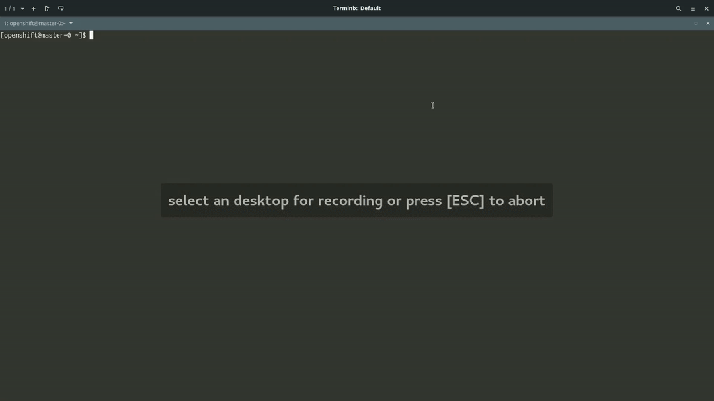

====================
Kuryr kubectl plugin
====================

This plugin aims to bring kuryr introspection an interaction to the kubectl and
oc command line tools.

Installation
------------

Place the kuryr directory in your ~/.kube/plugins

Usage
-----

The way to use it is via the kubectl/oc plugin facility::

    kubectl plugin kuryr get vif -o wide -l deploymentconfig=demo

Media
-----

You can see an example of its operation:

