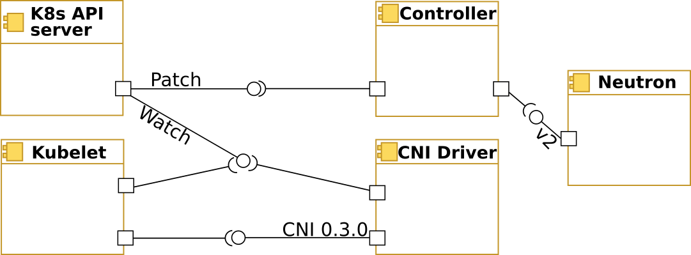
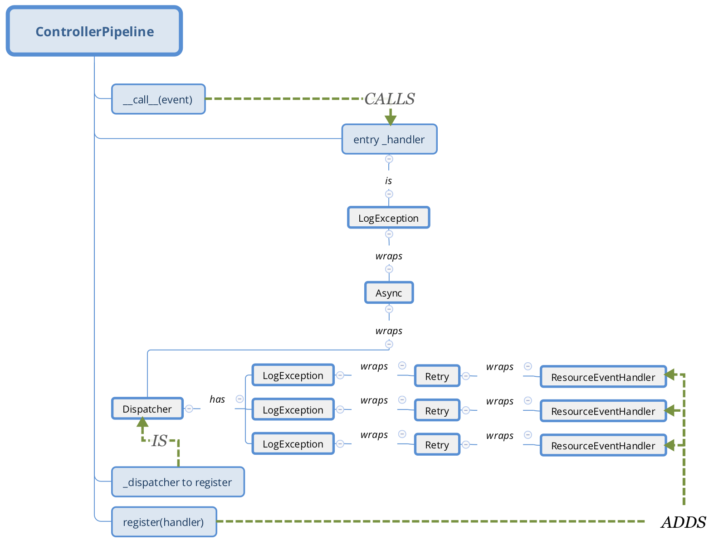
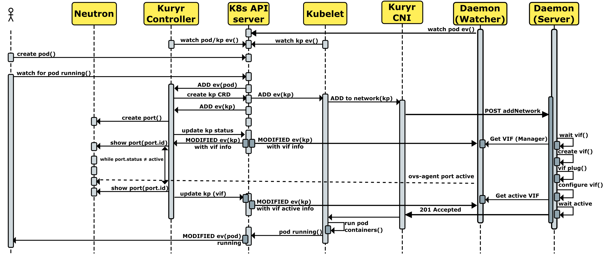

..
    This work is licensed under a Creative Commons Attribution 3.0 Unported
    License.

    http://creativecommons.org/licenses/by/3.0/legalcode

    Convention for heading levels in Neutron devref:
    =======  Heading 0 (reserved for the title in a document)
    -------  Heading 1
    ~~~~~~~  Heading 2
    +++++++  Heading 3
    '''''''  Heading 4
    (Avoid deeper levels because they do not render well.)

===================================
Kuryr Kubernetes Integration Design
===================================

Purpose
-------

The purpose of this document is to present the main Kuryr-K8s integration
components and capture the design decisions of each component currently taken
by the Kuryr team.

Goal Statement
--------------

Enable OpenStack Neutron realization of the Kubernetes networking. Start by
supporting network connectivity and expand to support advanced features, such
as Network Policies. In the future, it  may be extended to some  other
OpenStack services.

Overview
--------

In order to integrate Neutron into Kubernetes networking, 2 components are
introduced: Controller and CNI Driver. Controller is a supervisor component
responsible to maintain translation of networking relevant Kubernetes model
into the OpenStack (i.e. Neutron) model. This can be considered as a
centralized service (supporting HA mode in the future). CNI driver is
responsible for binding Kubernetes pods on worker nodes into Neutron ports
ensuring requested level of isolation. Please see below the component view of
the integrated system:

Design Principles
-----------------

#. Loose coupling between integration components.
#. Flexible deployment options to support different project, subnet and
   security groups assignment profiles.
#. The communication of the pod binding data between Controller and CNI driver
   should rely on existing communication channels, currently through the
   KuryrPort CRDs.
#. CNI Driver should not depend on Neutron. It gets all required details
   from Kubernetes API server (currently through Kubernetes CRDs),
   therefore depending on Controller to perform its translation tasks.
#. Allow different neutron backends to bind Kubernetes pods without code
   modification. This means that both Controller and CNI binding mechanism
   should allow loading of the vif management and binding components,
   manifested via configuration. If some vendor requires some extra code, it
   should be handled in one of the stevedore drivers.

Kuryr Controller Design
-----------------------

Controller is responsible for watching Kubernetes API endpoints to make sure
that the corresponding model is maintained in Neutron. Controller updates K8s
resources endpoints' annotations and/or CRDs to keep neutron details required
by the CNI driver as well as for the model mapping persistency.

Controller is composed from the following components:

Watcher
~~~~~~~

Watcher is a common software component used by both the  Controller and the CNI
driver. Watcher connects to Kubernetes API. Watcher's responsibility is to
observe the registered (either on startup or dynamically during its runtime)
endpoints and invoke registered callback handler (pipeline) to pass all events
from registered endpoints. As an example, if a Service is created at the
Kubernetes end, the ServiceHandler which is watching the Service Objects uses
the watcher to detect the changes on them and calls the right driver for the
reconciliation of Kubernetes and the needed OpenStack resources.

Event Handler
~~~~~~~~~~~~~

EventHandler is an interface class for the Kubernetes event handling. There are
several 'wrapper' event handlers that can be composed to implement Controller
handling pipeline.

**Retry** Event Handler is used for handling specified failures during event
processing. It can be used to 'wrap' another EventHandler and in case of
specified error will retry the wrapped event handler invocation within
specified timeout. In case of persistent failure, Retry will raise the wrapped
EventHandler exception.

**Async** Event Handler is used to execute event handling asynchronously.
Events are grouped based on the specified 'thread_groups'. Events of the same
group are processed in order of arrival. Thread group maps to an unique K8s
resource (each Pod, Service, etc.). Async can be used to 'wrap' another
EventHandler. Queues per thread group are added dynamically once relevant
events arrive and removed once queue is empty.

**LogExceptions** Event Handler suppresses exceptions and sends them to log
facility.

**Dispatcher** is an Event Handler that distributes events to registered
handlers based on event content and handler predicate provided during event
handler registration.

ControllerPipeline
~~~~~~~~~~~~~~~~~~

ControllerPipeline serves as an event dispatcher of the Watcher for Kuryr-K8s
controller Service. Currently watched endpoints are 'pods', 'services' and
'endpoints'. Kubernetes resource event handlers (Event Consumers) are
registered into the Controller Pipeline. There is a special EventConsumer,
ResourceEventHandler, that provides API for Kubernetes event handling. When a
watched event arrives, it is processed by all Resource Event Handlers
registered for specific Kubernetes object kind. Pipeline retries on resource
event handler invocation in case of the ResourceNotReady exception till it
succeeds or the number of retries (time-based) is reached. Any unrecovered
failure is logged without affecting other Handlers (of the current and other
events).  Events of the same group (same Kubernetes object) are handled
sequentially in the order arrival. Events of different Kubernetes objects are
handled concurrently.

ResourceEventHandler
~~~~~~~~~~~~~~~~~~~~

ResourceEventHandler is a convenience base class for the Kubernetes event
processing. The specific Handler associates itself with specific Kubernetes
object kind (through setting OBJECT_KIND) and  is expected to implement at
least one of the methods of the base class to handle at least one of the
ADDED/MODIFIED/DELETED events of the Kubernetes object. For details, see
`k8s-api`_.  Since both ADDED and MODIFIED event types trigger very similar
sequence of actions, Handler has 'on_present' method that is invoked for both
event types. The specific Handler implementation should strive to put all the
common ADDED and MODIFIED event handling logic in this method to avoid code
duplication.

Pluggable Handlers
~~~~~~~~~~~~~~~~~~

Starting with the Rocky release, Kuryr-Kubernetes includes a pluggable
interface for the Kuryr controller handlers.

The pluggable handlers framework allows :

- Using externally provided handlers.
- Controlling which handlers should be active.

To control which Kuryr Controller handlers should be active, the selected
handlers need to be included in kuryr.conf at the 'kubernetes' section.
If not specified, Kuryr Controller will run the default handlers, which
currently includes the following:

======================  =========================
  Handler                   Kubernetes resource
======================  =========================
vif                     Pod
kuryrport               KuryrPort CRD
endpoints               Endpoints
service                 Service
kuryrloadbalancer       KuryrLoadBalancer CRD
kuryrnetwork            KuryrNetwork CRD
namespace               Namespaces
kuryrnetworkpolicy      KuryrNetworkPolicy CRD
podlabel                Pod
policy                  NetworkPolicy
machine                 Machine
kuryrnetworkpopulation  KuryrNetwork CRD

======================  =========================

For example, to enable only the 'vif' controller handler we should set the
following at kuryr.conf:

.. code-block:: ini

   [kubernetes]
   enabled_handlers=vif,kuryrport

Note, that we have to specify vif and kuryrport together, since currently those
two plugins works together.

Providers
~~~~~~~~~

Provider (Drivers) are used by ResourceEventHandlers to manage specific aspects
of the Kubernetes resource in the OpenStack domain. For example, creating a
Kubernetes Pod will require a neutron port to be created on a specific network
with the proper security groups applied to it. There will be dedicated Drivers
for Project, Subnet, Port and Security Groups settings in neutron. For
instance, the Handler that processes pod events, will use PodVIFDriver,
PodProjectDriver, PodSubnetsDriver and PodSecurityGroupsDriver. The Drivers
model is introduced in order to allow flexibility in the Kubernetes model
mapping to the OpenStack. There can be different drivers that do Neutron
resources management, i.e. create on demand or grab one from the precreated
pool. There can be different drivers for the Project management, i.e. single
Tenant or multiple. Same goes for the other drivers. There are drivers that
handle the Pod based on the project, subnet and security groups specified via
configuration settings during cluster deployment phase.

NeutronPodVifDriver
~~~~~~~~~~~~~~~~~~~

PodVifDriver subclass should implement request_vif, release_vif and
activate_vif methods. In case request_vif returns Vif object in down state,
Controller will invoke activate_vif.  Vif 'active' state is required by the
CNI driver to complete pod handling.
The NeutronPodVifDriver is the default driver that creates neutron port upon
Pod addition and deletes port upon Pod removal.

CNI Driver
----------

CNI driver is just a thin client that passes CNI ADD and DEL requests to
kuryr-daemon instance via its HTTP API. It's a simple executable that is
supposed to be called by kubelet's CNI. Since Train release the CNI driver
has an alternative golang implementation (see the kuryr_cni directory) to make
injecting it onto the Kubernetes node from the kuryr-cni pod easier. This
enables Kuryr to work on K8s deployments that does not have Python or curl on
Kubernetes nodes. Compatibility between Python and golang CNI drivers is
supposed to be maintained.

.. _cni-daemon:

CNI Daemon
----------

CNI Daemon is a service that should run on every Kubernetes node. Starting from
Rocky release it should be seen as a default supported deployment option. And
running without it is impossible starting from Stein release. It is responsible
for watching pod events on the node it's running on, answering calls from CNI
Driver and attaching VIFs when they are ready. In the future it will also keep
information about pooled ports in memory. This helps to limit the number of
processes spawned when creating multiple Pods, as a single Watcher is enough
for each node and CNI Driver will only wait on local network socket for
response from the Daemon.

Currently CNI Daemon consists of two processes i.e. Watcher and Server.
Processes communicate between each other using Python's
``multiprocessing.Manager`` and a shared dictionary object. Watcher is
responsible for extracting VIF information from KuryrPort CRD events and
putting them into the shared dictionary. Server is a regular WSGI server that
will answer CNI Driver calls. When a CNI request comes, Server is waiting for
VIF object to appear in the shared dictionary. As CRD data is read from
kubernetes API and added to the registry by Watcher thread, Server will
eventually get VIF it needs to connect for a given pod. Then it waits for the
VIF to become active before returning to the CNI Driver.

Communication
~~~~~~~~~~~~~

CNI Daemon Server is starting an HTTP server on a local network socket
(``127.0.0.1:5036`` by default). Currently server is listening for 2 API
calls. Both calls load the ``CNIParameters`` from the body of the call (it is
expected to be JSON).

For reference see updated pod creation flow diagram:

/addNetwork
+++++++++++

**Function**: Is equivalent of running ``K8sCNIPlugin.add``.

**Return code:** 202 Accepted

**Return body:** Returns VIF data in JSON form. This is serialized
oslo.versionedobject from ``os_vif`` library. On the other side it can be
deserialized using o.vo's ``obj_from_primitive()`` method.

/delNetwork
+++++++++++

**Function**: Is equivalent of running ``K8sCNIPlugin.delete``.

**Return code:** 204 No content

**Return body:** None.

When running in daemonized mode, CNI Driver will call CNI Daemon over those
APIs to perform its tasks and wait on socket for result.

Kubernetes Documentation
------------------------

The `Kubernetes reference documentation`_ is a great source for finding more
details about Kubernetes API, CLIs, and tools.

.. _k8s-api: https://github.com/kubernetes/kubernetes/blob/release-1.4/docs/devel/api-conventions.md#types-kinds>
.. _Kubernetes reference documentation: https://kubernetes.io/docs/reference/
