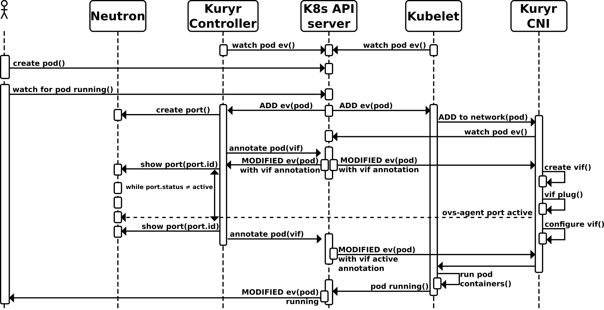

..
    This work is licensed under a Creative Commons Attribution 3.0 Unported
    License.

    http://creativecommons.org/licenses/by/3.0/legalcode

    Convention for heading levels in Neutron devref:
    =======  Heading 0 (reserved for the title in a document)
    -------  Heading 1
    ~~~~~~~  Heading 2
    +++++++  Heading 3
    '''''''  Heading 4
    (Avoid deeper levels because they do not render well.)

===================================
Kuryr Kubernetes Integration Design
===================================

Purpose
-------
The purpose of this document is to present the main Kuryr-K8s integration
components and capture the design decisions of each component currently taken
by the kuryr team.

Goal Statement
--------------
Enable OpenStack Neutron realization of the Kubernetes networking. Start by
supporting network connectivity and expand to support advanced features, such
as Network Policies. In the future, it  may be extended to some  other
openstack services.

Overview
--------
In order to integrate Neutron into kubernetes networking, 2 components are
introduced: Controller and CNI Driver.
Controller is a supervisor component responsible to maintain translation of
networking relevant K8s model into the OpenStack (i.e. Neutron) model.
This can be considered as a centralized service (supporting HA mode in the
future).
CNI driver is responsible for binding kubernetess pods on worker nodes into
Neutron ports ensuring requested level of isolation.
Please see below the component view of the integrated system:

.. image:: ../../images/kuryr_k8s_components.png
    :alt: integration components
    :align: center
    :width: 100%

Design Principles
-----------------
1. Loose coupling between integration components.
2. Flexible deployment options to support different project, subnet and
   security groups assignment profiles.
3. The communication of the pod binding data between Controller and CNI driver
   should rely on existing communication channels, currently added to the pod
   metadata via annotations.
4. CNI Driver should not depend on Neutron. It gets all required details
   from K8s API server (currenltly through K8s annotations), therefore
   depending on Controller to perform its translation tasks.
5. Allow different neutron backends to bind K8s pods without code modification.
   This means that both Controller and CNI binding mechanism should allow
   loading of the vif management and binding components, manifested via
   configuration. If some vendor requires some extra code, it should be handled
   in one of the stevedore drivers.

Kuryr Controller Design
-----------------------
Controller is responsible for watching Kubernetess API endpoints to make sure
that the corresponding model is maintained in Neutron. Controller updates K8s
resources  endpoints’ annotations to keep neutron details required by the CNI
driver as well as for the model mapping persistency.

Controller is composed from the following components:

Watcher
~~~~~~~
Watcher is a common software component used by both the  Controller and the CNI
driver. Watcher connects to K8s API. Watcher’s responsibility is to observe the
registered (either on startup or dynamically during its runtime) endpoints and
invoke registered callback handler (pipeline) to pass all events from
registered endpoints.

Event Handler
~~~~~~~~~~~~~
EventHandler is an interface class for the K8s event handling. There are
several 'wrapper' event handlers that can be composed to implement Controller
handling pipeline.

**Retry** Event Handler is used for handling specified failures during event
processing. It can be used to ‘wrap’ another EventHandler and in case of
specified error will retry the wrapped event handler invocation within
specified timeout. In case of persistent failure, Retry will raise the wrapped
EventHandler exception.

**Async** Event Handler is used to execute event handling asynchronously.
Events are grouped based on the specified ‘thread_groups’. Events of the same
group are processed in order of arrival. Thread group maps to an unique K8s
resource (each Pod, Service, etc.). Async can be used to ‘wrap’ another
EventHandler. Queues per thread group are added dynamically once relevant
events arrive and removed once queue is empty.

**LogExceptions** Event Handler suppresses exceptions and sends them to log
facility.

**Dispatcher** is an Event Handler that distributes events to registered
handlers based on event content and handler predicate provided during event
handler registration.

ControllerPipeline
~~~~~~~~~~~~~~~~~~
ControllerPipeline serves as an event dispatcher of the Watcher for Kuryr-K8s
controller Service. Currently watched endpoints are 'pods', 'services' and
'endpoints'. K8s resource event handlers (Event Consumers) are registered into
the Controller Pipeline. There is a special EventConsumer, ResourceEventHandler,
that provides API for K8s event handling. When a watched event arrives, it is
processed by all Resource Event Handlers registered for specific K8s object
kind. Pipeline retries on resource event handler invocation in
case of the ResourceNotReady exception till it succeeds or the number of
retries (time-based) is reached. Any unrecovered failure is logged without
affecting other Handlers (of the current and other events).
Events of the same group (same K8s object) are handled sequentially in the
order arrival. Events of different K8s objects are handled concurenlty.

.. image:: ../..//images/controller_pipeline.png
    :alt: controller pipeline
    :align: center
    :width: 100%

ResourceEventHandler
~~~~~~~~~~~~~~~~~~~~
ResourceEventHandler is a convenience base class for the K8s event processing.
The specific Handler associates itself with specific K8s object kind (through
setting OBJECT_KIND) and  is expected to implement at least one of the methods
of the base class to handle at least one of the ADDED/MODIFIED/DELETED events
of the k8s object. For details, see `k8s-api  <https://github.com/kubernetes/kubernetes/blob/release-1.4/docs/devel/api-conventions.md#types-kinds>`_.
Since both ADDED and MODIFIED event types trigger very similar sequence of
actions, Handler has ‘on_present’ method that is invoked for both event types.
The specific Handler implementation should strive to put all the common ADDED
and MODIFIED event handling logic in this method to avoid code duplication.

Providers
~~~~~~~~~
Provider (Drivers) are used by ResourceEventHandlers to manage specific aspects
of the K8s resource in the OpenStack domain. For example, creating a K8s Pod
will require a neutron port to be created on a specific network with the proper
security groups applied to it. There will be dedicated Drivers for Project,
Subnet, Port and Security Groups settings in neutron. For instance, the Handler
that processes pod events, will use PodVIFDriver, PodProjectDriver,
PodSubnetsDriver and PodSecurityGroupsDriver. The Drivers model is introduced
in order to allow flexibility in the K8s model mapping to the OpenStack. There
can be different drivers that do Neutron resources management, i.e. create on
demand or grab one from the precreated pool. There can be different drivers for
the Project management, i.e. single Tenant or multiple. Same goes for the other
drivers. There are drivers that handle the Pod based on the project, subnet
and security groups specified via configuration settings during cluster
deployment phase.

NeutronPodVifDriver
~~~~~~~~~~~~~~~~~~~
PodVifDriver subclass should implement request_vif, release_vif and
activate_vif methods. In case request_vif returns Vif object in down state,
Controller will invoke activate_vif.  Vif ‘active’ state is required by the
CNI driver to complete pod handling.
The NeutronPodVifDriver is the default driver that creates neutron port upon
Pod addition and deletes port upon Pod removal.

CNI Driver
----------
Kuryr kubernetes integration takes advantage of the kubernetes `CNI plugin <http://kubernetes.io/docs/admin/network-plugins/#cni>`_
and introduces Kuryr-K8s CNI Driver. Based on design decision, kuryr-kubernetes
CNI Driver should get all information required to plug and bind Pod via
kubernetes control plane and should not depend on Neutron. CNI plugin/driver
is invoked in a blocking manner by kubelet (k8s node agent), therefore it is
expected to return when either success or error state determined.

Kuryr-K8s CNI Driver has 2 sources for Pod binding information: kubelet/node
environment and K8s API. The Kuryr-K8s Controller Service and CNI share the
contract that defines Pod annotation that Controller Server adds and CNI
driver reads. The contract is `os_vif VIF <https://github.com/openstack/os-vif/blob/master/os_vif/objects/vif.py>`_

With VIF object loaded from the Pod object annotation, the CNI driver performs
Pod plugging. Kuryr-K8s CNI driver uses ov_vif library to perform Pod plug and
unplug operations. The CNI driver should complete its job and return control to
Kubelet when all the network plugging is completed.
In the cases when Neutron initially creates port in ‘Down’ state, CNI driver
will plug the Pod, but will have to watch the Pod annotations for vif state
change to ‘Active’ before returning the control to the caller.

Kubernetes Documentation
------------------------
The `Kubernetes reference documentation <https://kubernetes.io/docs/reference/>`_
is a great source for finding more details about Kubernetes API, CLIs, and tools.
