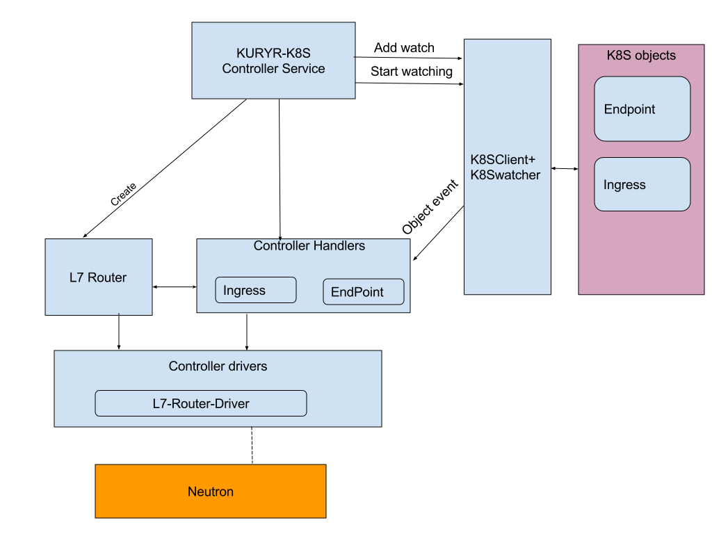
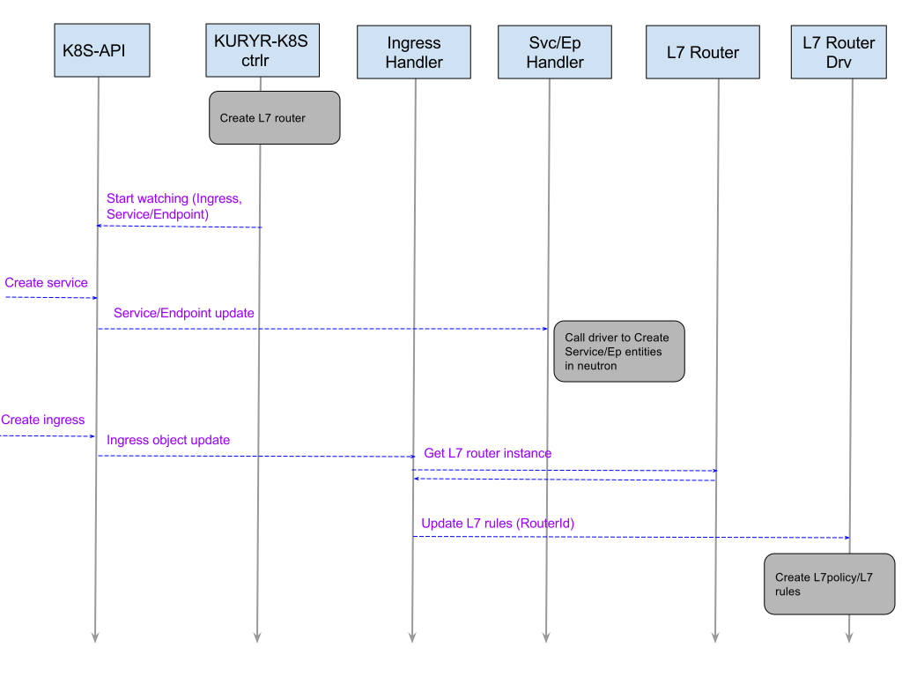
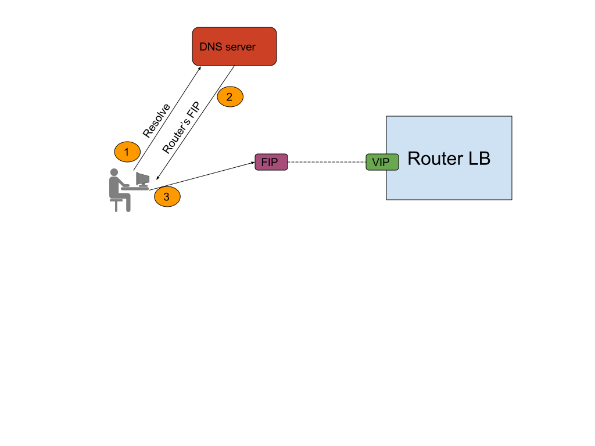
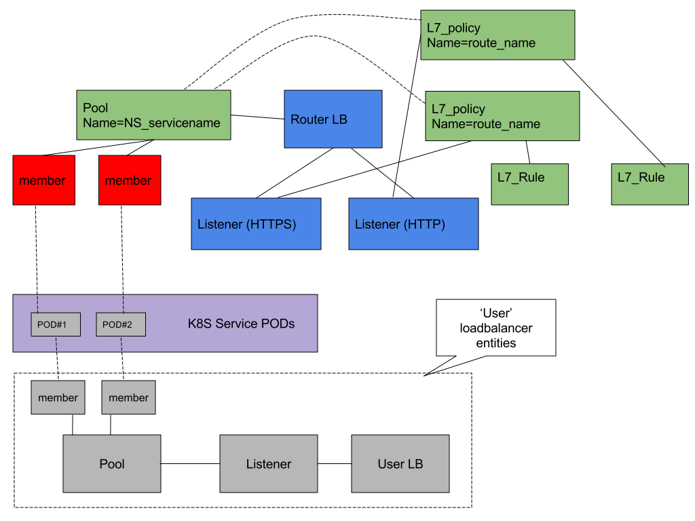

..
    This work is licensed under a Creative Commons Attribution 3.0 Unported
    License.

    http://creativecommons.org/licenses/by/3.0/legalcode

    Convention for heading levels in Neutron devref:
    =======  Heading 0 (reserved for the title in a document)
    -------  Heading 1
    ~~~~~~~  Heading 2
    +++++++  Heading 3
    '''''''  Heading 4
    (Avoid deeper levels because they do not render well.)

===========================================
Kuryr Kubernetes Ingress integration design
===========================================

Purpose
-------
The purpose of this document is to present how Kubernetes Ingress controller
is supported by the kuryr integration.

Overview
--------
A Kubernetes Ingress [1]_ is used to give services externally-reachable URLs,
load balance traffic, terminate SSL, offer name based virtual
hosting, and more.
Each Ingress consists of a name, service identifier, and (optionally)
security configuration.

A Kubernetes Ingress Controller [2]_ is an entity that watches the apiserver's
/ingress resources for updates. Its job is to satisfy requests for Ingresses.

Proposed Solution
-----------------
The suggested solution is based on extension of the kuryr-kubernetes controller
handlers functionality to support kubernetes Ingress resources.
This extension should watch kubernetes Ingresses resources, and the
Service/Endpoints that Ingress is pointing to.
The Ingress and Service/Endpoints controller handlers are responsible for
updating the L7 rules in a L7 router's database.

A L7 router is a logical entity responsible for L7 routing based on L7 rules
database, when an HTTP packet hits the L7 router, the L7 router uses its
rules database to determine the endpoint destination (based on the fields
content in HTTP header, e.g: HOST_NAME).
Kuryr will use neutron LBaaS L7 policy capability [3]_ to perform
the L7 routing task.

SW architecture:
----------------
The following scheme describes the SW modules that provides Ingress controller
capability in Kuryr Kubernetes context:

The Ingress controller functionality will be composed of the following software
modules:

1. L7 Router
2. Ingress Handler
3. Extension to Service/Endpoints Handler
4. L7 Router Driver

Each one of this modules is detailed described below.

Ingress resource creation
~~~~~~~~~~~~~~~~~~~~~~~~~
The kuryr-kubernetes controller will create the L7 router,
and both Ingress and Service/Endpoints handlers should update the L7
rules database of the L7 router.

The next diagram illustrates creation of Ingress resource in kuryr-kubernetes
ingress controller SW :

The L7 Router
~~~~~~~~~~~~~
In Kuryr context, a L7 router is actually an externally reachable
loadbalancer with L7 capabilities.
For achieving external connectivity the L7 router is attached to a floating
IP (allocated from 'external_svc_subnet').

The following parameters should be configured in kuryr.conf file to
enable L7 Router::

         [ingress]
         l7_router_uuid=<loadbalancer uuid>
         [kubernetes]
         enable_ingress = True
         # make sure that 'ingresslb' appears in enabled_handlers
         enabled_handlers= vif,lb,lbaasspec,ingresslb

The L7 Router should notify the Health Manager upon any failure that could
lead to L7 Router's malfunctionality.

The DNS should be configured to point external traffic to L7 Router's
FIP.

The next diagram illustrates data flow from external user to L7 router:

Ingress Handler
~~~~~~~~~~~~~~~
The Ingress Handler watches the apiserver's for updates to
the Ingress resources and should satisfy requests for Ingresses.
Each Ingress being translated to a L7 policy in L7 router, and the rules on
the Ingress become L7 (URL) mapping rules in that L7 policy.
The L7 policy is configured to forward the filtered traffic to a LBaaS Pool.
The LBaaS pool represents an Service/Endpoints resource, and it's the
Service/Endpoints handler responsibility to attach all the Service/Endpoints
members to this pool.
Since the Service/Endpoints resource is not aware of changes in Ingress objects
pointing to it, the Ingress handler should trigger this notification,
the notification will be implemented using annotation.

Service/Endpoints Handler
~~~~~~~~~~~~~~~~~~~~~~~~~
The Service/Endpoints handler should be **extended** to support the flows
involving Ingress resources.
The Service/Endpoints handler should add/delete all its members to/from the
LBaaS pool mentioned above, in case an Ingress is pointing this
Service/Endpoints as its destination.

The L7 router driver
~~~~~~~~~~~~~~~~~~~~
The L7 router, Ingress handler and Service/Endpoints handler will
call the L7 router driver services to create the L7 routing entities chain.
The L7 router driver will rely on neutron LBaaS functionality.

**Note:** Neutron LBaaS L7 functions are implemented *only* for the OCTAVIA
provider, in case L7 routing is required the Neutron LBaaS provider must be
configured to be OCTAVIA.

A diagram describing both L7 router and user loadbalancer Neutron LBaaS
entities is given below:

- The blue components are created/released by the L7 router.
- The green components are created/released by Ingress handler.
- The red components are created/released by Service/Endpoints handler.

Use cases examples
~~~~~~~~~~~~~~~~~~
This section describe in details the following scenarios:

  A. Create Ingress, create Service/Endpoints.
  B. Create Service/Endpoints, create Ingress, delete Ingress.

* Create Ingress, create Service/Endpoints:

  * Ingress is created under namespace 'mynamespace'

    * Ingress details :

    .. code-block:: yaml

        apiVersion: extensions/v1beta1
        kind: Ingress
        metadata:
        name: test
        spec:
        rules:
        - host: www.example.com
            http:
            paths:
            - backend:
                serviceName: s1
                servicePort: 80

    * Since its the first Ingress pointing to this Service, the Ingress
      handler will create LBaaS pool (attached to L7 router)- named
      'mynamespace_s1'.

    * The Ingress handler will create a L7 rule and L7 policy, the L7 policy
      direct its filtered traffic towards 'mynamespace_s1' pool.

  * Service/Endpoints is created under namespace 'mynamespace'

    * name: s1

    * The Service/Endpoints handler will create user loadbalancer, listeners,
      pools and members.

    * The Service/Endpoints handler will check for pool named
      'mynamespace_s1' and will add its members to this pool.

* Create Service/Endpoints, create Ingress, delete Ingress:

  * Service/Endpoints is created under namespace 'mynamespace'

    * name: s1

    * The Service/Endpoints handler will create user loadbalancer, listeners,
      pools and members.
    * Since no pool named 'mynamespace_s1' exist in L7 router,
      no operation is required.

  * Ingress is created with same details as described in above yaml file.

    * Since its the first Ingress pointing to this Service, the Ingress
      handler will create LBaaS pool (attached to L7 router)
      named 'mynamespace_s1'.
    * The Ingress handler will create a L7 rule and L7 policy, the L7 policy
      configured to direct its filtered traffic towards 'mynamespace_s1' pool.

    * The last step from Ingress handler will be to notify
      (using annotation) s1 Service/Endpoints.

    * As a result to the Ingress notification, the Service/Endpoints handler will
      be called.
      The Service/Endpoints handler will update the members information attached to
      'mynamespace_s1' pool.

  * Ingress is deleted

    * Ingress handler will first delete L7 rule and L7 policy.

    * In case no other L7 policy is pointing 'mynamespace_s1', the Ingress
      handler will delete 'mynamespace_s1' pool's members and the pool
      itself. The last step from Ingress handler will be to notify s1
      Service/Endpoints.

    * As a result to the Ingress handler notification, the Service/Endpoints
      handler will set its internal state to 'no Ingress is pointing' state.

References
==========
.. [1] https://kubernetes.io/docs/concepts/services-networking/ingress/#what-is-ingress
.. [2] https://github.com/kubernetes/ingress-nginx/blob/master/README.md
.. [3] https://wiki.openstack.org/wiki/Neutron/LBaaS/l7

