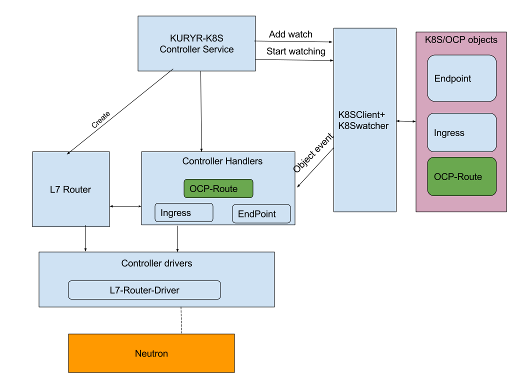

..
    This work is licensed under a Creative Commons Attribution 3.0 Unported
    License.

    http://creativecommons.org/licenses/by/3.0/legalcode

    Convention for heading levels in Neutron devref:
    =======  Heading 0 (reserved for the title in a document)
    -------  Heading 1
    ~~~~~~~  Heading 2
    +++++++  Heading 3
    '''''''  Heading 4
    (Avoid deeper levels because they do not render well.)

====================================================
Kuryr Kubernetes Openshift Routes integration design
====================================================

Purpose
-------
The purpose of this document is to present how Openshift Routes are supported
by kuryr-kubernetes.

Overview
--------
OpenShift Origin [1]_ is an open source cloud application development and
hosting platform that automates the provisioning, management and scaling
of applications.

OpenShift Origin is a distribution of Kubernetes optimized for continuous
application development and multi-tenancy deployment. OpenShift adds developer
and operations-centric tools on top of Kubernetes to enable rapid application
development, easy deployment and scaling, and long-term lifecycle maintenance.

An OpenShift Route [2]_ exposes a Service at a host name, like www.example.com,
so that external clients can reach it by name.
The Route is an Openshift resource that defines the rules you want to apply to
incoming connections.
The Openshift Routes concept introduced before Ingress [3]_ was supported by
kubernetes, the Openshift Route matches the functionality of kubernetes Ingress.

Proposed Solution
-----------------
The solution will rely on L7 router, Service/Endpoints handler and
L7 router driver components described at kuryr-kubernetes Ingress integration
design, where a new component - OCP-Route handler, will satisfy requests for
Openshift Route resources.

Controller Handlers impact:
---------------------------
The controller handlers should be extended to support OCP-Route resource.

The OCP-Route handler
~~~~~~~~~~~~~~~~~~~~~
The OCP-Route handler watches the apiserver's for updates to Openshift
Route resources.
The following scheme describes OCP-Route controller SW architecture:

Similar to Kubernetes Ingress, each OCP-Route object being translated to a L7
policy in L7 router, and the rules on OCP-Route become L7 (URL) mapping rules
in that L7 policy.
The L7 policy is configured to forward the filtered traffic to LbaaS Pool.
The LbaaS pool represents an Endpoints resource, and it's the Service/Endpoints
handler responsibility to attach all its members to this pool.
Since the Endpoints resource is not aware of changes in OCP-Route objects
pointing to it, the OCP-Route handler should trigger this notification,
the notification will be implemented using annotation of the relevant
Endpoint resource.

Use cases examples
~~~~~~~~~~~~~~~~~~
This section describes in details the following scenarios:

  A. Create OCP-Route, create Service/Endpoints.
  B. Create Service/Endpoints, create OCP-Route, delete OCP-Route.

* Create OCP-Route, create Service/Endpoints:

  * OCP-Route is created under namespace 'mynamespace'

    * OCP-Route details :

    .. code-block:: yaml

        apiVersion: v1
        kind: Route
        metadata:
          name: test
          spec:
            host: www.example.com
            to:
              kind: Service
              name: s1

    * Since it's the first route pointing to this Service, the OCP-Route
      handler will create LbaaS pool (attached to L7 router)- named
      'mynamespace_s1'.

    * The OCP-Route handler will create L7 rule and L7 policy, the L7
      policy direct it's filtered traffic towards 'mynamespace_s1' pool.

  * Service/Endpoints is created under namespace 'mynamespace'

    * name: s1

    * The Service/Endpoints handler will create user loadbalancer

    * The Service/Endpoints handler will check for pool named
      'mynamespace_s1' and add its members to this pool.

* Create Service/Endpoints, create OCP-Route, delete OCP-Route:

  * Service/Endpoints is created under namespace 'mynamespace'

    * name: s1

    * The Service/Endpoints handler will create user loadbalancer
    * Since no pool named 'mynamespace_s1' exist in L7 router,
      Service will exit.

  * OCP-Route is created with same details as described in above yaml file.

    * Since it's the first route pointing to this Service, the OCP-Route
      handler will create LbaaS pool (attached to L7 router) named
      'mynamespace_s1'.
    * The OCP-Route handler will create L7 rule and L7 policy, the L7 policy
      configured to direct its filtered traffic towards 'mynamespace_s1' pool.

    * The last step from OCP-Route handler will be to notify
      (using annotation) s1 Endpoint.

    * As a result to the OCP-Route notification, the Endpoint handler will
      be called.
      The Service/Endpoints handler will update the members information
      attached to 'mynamespace_s1' pool.

  * OCP-Route is deleted

    * OCP-Route handler will first delete L7 rule and L7 policy.

    * In case no other L7 policy is pointing 'mynamespace_s1' pool, the
      OCP-Route handler will delete 'mynamespace_s1' pool's members and the pool
      itself. The last step from Ingress handler will be to notify s1
      Service/Endpoints.

    * As a result to the OCP-Route handler notification, the Service/Endpoints
      handler will set its internal state to 'no Ingress is pointing' state.

References
==========
.. [1] https://www.openshift.org/
.. [2] https://docs.openshift.com/enterprise/3.0/architecture/core_concepts/routes.html
.. [3] https://kubernetes.io/docs/concepts/Services-networking/ingress/
