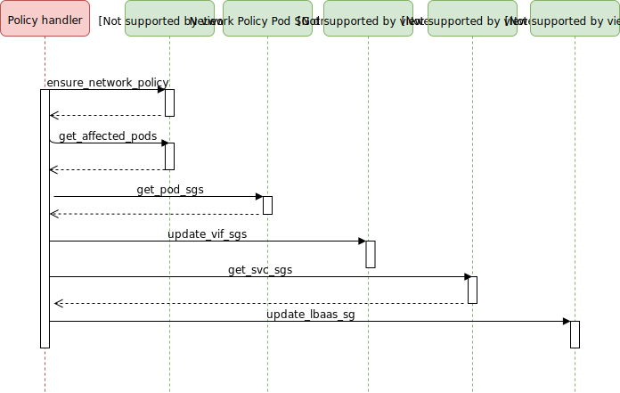
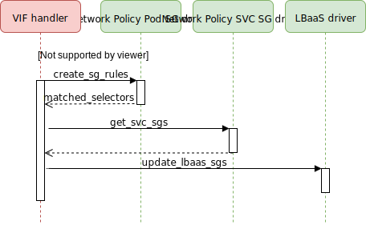

..
        This work is licensed under a Creative Commons Attribution 3.0 Unported
      License.

      http://creativecommons.org/licenses/by/3.0/legalcode

      Convention for heading levels in Neutron devref:
      =======  Heading 0 (reserved for the title in a document)
      -------  Heading 1
      ~~~~~~~  Heading 2
      +++++++  Heading 3
      '''''''  Heading 4
      (Avoid deeper levels because they do not render well.)

================================
Network Policy
================================

Purpose
--------
The purpose of this document is to present how Network Policy is supported by
Kuryr-Kubernetes.

Overview
--------
Kubernetes supports a Network Policy object to express ingress and egress rules
for pods. Network Policy reacts on labels to qualify multiple pods, and defines
rules based on differents labeling and/or CIDRs. When combined with a
networking plugin, those policy objetcs are enforced and respected.

Proposed Solution
-----------------
Kuryr-Kubernetes relies on Neutron security groups and security group rules to
enforce a Network Policy object, more specifically one security group per policy
with possibly multiple rules. Each object has a namespace scoped Network Policy
CRD that stores all OpenStack related resources on the Kubernetes side, avoiding
many calls to Neutron and helping to differentiate between the current Kubernetes
status of the Network Policy and the last one Kuryr-Kubernetes enforced.

The network policy CRD has the following format:

.. code-block:: yaml

    apiVersion: openstack.org/v1
    kind: KuryrNetPolicy
    metadata:
      ...
    spec:
      egressSgRules:
      - security_group_rule:
        ...
      ingressSgRules:
      - security_group_rule:
        ...
      networkpolicy_spec:
        ...
      podSelector:
        ...
      securityGroupId: ...
      securityGroupName: ...

A new handler has been added to react to Network Policy events, and the existing
ones, for instance service/pod handlers, have been modified to account for the
side effects/actions of when a Network Policy is being enforced.

.. note::
    Kuryr supports a network policy that contains:
     * Ingress and Egress rules
     * namespace selector and pod selector, defined with match labels or match
       expressions, mix of namespace and pod selector, ip block
     * named port

New handlers and drivers
++++++++++++++++++++++++

The Network Policy handler
~~~~~~~~~~~~~~~~~~~~~~~~~~
This handler is responsible for triggering the Network Policy Spec processing,
and the creation or removal of security group with appropriate security group
rules. It also, applies the security group to the pods and services affected
by the policy.

The Pod Label handler
~~~~~~~~~~~~~~~~~~~~~
This new handler is responsible for triggering the update of a security group
rule upon pod labels changes, and its enforcement on the pod port and service.

The Network Policy driver
~~~~~~~~~~~~~~~~~~~~~~~~~~
Is the main driver. It ensures a Network Policy by processing the Spec
and creating or updating the Security group with appropriate
security group rules.

The Network Policy Security Group driver
~~~~~~~~~~~~~~~~~~~~~~~~~~~~~~~~~~~~~~~~
It is responsible for creating, deleting, or updating security group rules
for pods, namespaces or services based on different Network Policies.

Modified handlers and drivers
+++++++++++++++++++++++++++++

The VIF handler
~~~~~~~~~~~~~~~
As network policy rules can be defined based on pod labels, this handler
has been enhanced to trigger a security group rule creation or deletion,
depending on the type of pod event, if the pod is affected by the network
policy and if a new security group rule is needed. Also, it triggers the
translation of the pod rules to the affected service.

The Namespace handler
~~~~~~~~~~~~~~~~~~~~~
Just as the pods labels, namespaces labels can also define a rule in a
Network Policy. To account for this, the namespace handler has been
incremented to trigger the creation, deletion or update of a
security group rule, in case the namespace affects a Network Policy rule,
and the translation of the rule to the affected service.

The Namespace Subnet driver
~~~~~~~~~~~~~~~~~~~~~~~~~~~
In case of a namespace event and a Network Policy enforcement based
on the namespace, this driver creates a subnet to this namespace,
and restrict the number of security group rules for the Network Policy
to just one with the subnet CIDR, instead of one for each pod in the namespace.

The LBaaS driver
~~~~~~~~~~~~~~~~
To restrict the incoming traffic to the backend pods, the LBaaS driver
has been enhanced to translate pods rules to the listener port, and react
to Service ports updates. E.g., when the target port is not allowed by the
policy enforced in the pod, the rule should not be added.

The VIF Pool driver
~~~~~~~~~~~~~~~~~~~
The VIF Pool driver is responsible for updating the Security group applied
to the pods ports. It has been modified to embrace the fact that with Network
Policies pods' ports changes their security group while being used, meaning the
original pool does not fit them anymore, resulting in useless pools and ports
reapplying the original security group. To avoid it, the security group id
is removed from the pool merging all pools with same network, project
and host id. Thus if there is no ports on the pool with the needed
security group id(s), one of the existing ports in the pool is updated
to match the requested sg Id.

Use cases examples
++++++++++++++++++
This section describes some scenarios with a Network Policy being enforced,
what Kuryr componenets gets triggered and what resources are created.

Deny all incoming traffic
~~~~~~~~~~~~~~~~~~~~~~~~~

By default, Kubernetes clusters do not restrict traffic. Only once a network
policy is enforced to a namespace, all traffic not explicitly allowed in the
policy becomes denied. As specified in the following policy:

.. code-block:: yaml

    apiVersion: networking.k8s.io/v1
    kind: NetworkPolicy
    metadata:
      name: default-deny
    spec:
      podSelector: {}
      policyTypes:
      - Ingress

The following CRD is the translation of policy rules to security group rules.
No ingress rule was created, which means traffic is blocked, and since
there is no restriction for egress traffic, it is allowed to everywhere. Note
that the same happens when no ``policyType`` is defined, since all policies
are assumed to assumed to affect Ingress.

.. code-block:: yaml

    apiVersion: openstack.org/v1
    kind: KuryrNetPolicy
    metadata:
      name: np-default-deny
      namespace: default
      ...
    spec:
      egressSgRules:
      - security_group_rule:
          description: Kuryr-Kubernetes NetPolicy SG rule
          direction: egress
          ethertype: IPv4
          id: 60a0d59c-2102-43e0-b025-75c98b7d9315
          security_group_id: 20d9b623-f1e0-449d-95c1-01624cb3e315
      ingressSgRules: []
      networkpolicy_spec:
        ...
      podSelector:
        ...
      securityGroupId: 20d9b623-f1e0-449d-95c1-01624cb3e315
      securityGroupName: sg-default-deny

Allow traffic from pod
~~~~~~~~~~~~~~~~~~~~~~

The following Network Policy specification has a single rule allowing traffic
on a single port from the group of pods that have the label ``role=monitoring``.

.. code-block:: yaml

     apiVersion: networking.k8s.io/v1
    kind: NetworkPolicy
    metadata:
      name: allow-monitoring-via-pod-selector
    spec:
      podSelector:
        matchLabels:
          app: server
      policyTypes:
      - Ingress
      ingress:
      - from:
        - podSelector:
            matchLabels:
              role: monitoring
        ports:
        - protocol: TCP
          port: 8080

Create the following pod with label ``role=monitoring``::

    $ kubectl run  monitor --image=busybox --restart=Never --labels=role=monitoring

The generated CRD contains an ingress rule allowing traffic on port 8080 from
the created pod, and an egress rule allowing traffic to everywhere, since no
restriction was enforced.

.. code-block:: yaml

    apiVersion: openstack.org/v1
    kind: KuryrNetPolicy
    metadata:
      name: np-allow-monitoring-via-pod-selector
      namespace: default
      ...
    spec:
      egressSgRules:
      - security_group_rule:
          description: Kuryr-Kubernetes NetPolicy SG rule
          direction: egress
          ethertype: IPv4
          id: 203a14fe-1059-4eff-93ed-a42bd957145d
          security_group_id: 7f0ef8c2-4846-4d8c-952f-94a9098fff17
      ingressSgRules:
      - namespace: default
        security_group_rule:
          description: Kuryr-Kubernetes NetPolicy SG rule
          direction: ingress
          ethertype: IPv4
          id: 7987c382-f2a9-47f7-b6e8-1a3a1bcb7d95
          port_range_max: 8080
          port_range_min: 8080
          protocol: tcp
          remote_ip_prefix: 10.0.1.143
          security_group_id: 7f0ef8c2-4846-4d8c-952f-94a9098fff17
      networkpolicy_spec:
        ...
      podSelector:
        ...
      securityGroupId: 7f0ef8c2-4846-4d8c-952f-94a9098fff17
      securityGroupName: sg-allow-monitoring-via-pod-selector

Allow traffic from namespace
~~~~~~~~~~~~~~~~~~~~~~~~~~~~

The following network policy only allows allowing ingress traffic
from namespace with the label ``purpose=test``:

.. code-block:: yaml

    apiVersion: networking.k8s.io/v1
    kind: NetworkPolicy
    metadata:
      name: allow-test-via-ns-selector
    spec:
      podSelector:
        matchLabels:
          app: server
      policyTypes:
      - Ingress
      ingress:
      - from:
        - namespaceSelector:
            matchLabels:
              purpose: test
        ports:
        - protocol: TCP
          port: 8080

Create a namespace and label it with ``purpose=test``::

    $ kubectl create namespace dev
    $ kubectl label namespace dev purpose=test

The resulting CRD has an ingress rule allowing traffic
from the namespace CIDR on the specified port, and an
egress rule allowing traffic to everywhere.

.. code-block:: yaml

    apiVersion: openstack.org/v1
    kind: KuryrNetPolicy
      name: np-allow-test-via-ns-selector
      namespace: default
      ...
    spec:
      egressSgRules:
      - security_group_rule:
          description: Kuryr-Kubernetes NetPolicy SG rule
          direction: egress
          ethertype: IPv4
          id: 8c21bf42-c8b9-4628-b0a1-bd0dbb192e6b
          security_group_id: c480327c-2db4-4eb6-af1e-eeb0ce9b46c9
      ingressSgRules:
      - namespace: dev
        security_group_rule:
          description: Kuryr-Kubernetes NetPolicy SG rule
          direction: ingress
          ethertype: IPv4
          id: 2a33b802-56ad-430a-801d-690f653198ef
          port_range_max: 8080
          port_range_min: 8080
          protocol: tcp
          remote_ip_prefix: 10.0.1.192/26
          security_group_id: c480327c-2db4-4eb6-af1e-eeb0ce9b46c9
      networkpolicy_spec:
        ...
      podSelector:
        ...
      securityGroupId: c480327c-2db4-4eb6-af1e-eeb0ce9b46c9
      securityGroupName: sg-allow-test-via-ns-selector

.. note::
    The Service security groups need to be rechecked when a network policy
    that affects ingress traffic is created, and also everytime
    a pod or namespace is created.

Create network policy flow
~~~~~~~~~~~~~~~~~~~~~~~~~~

Create pod flow
~~~~~~~~~~~~~~~
The following diagram only covers the implementation part that affects
network policy.

Network policy rule definition
~~~~~~~~~~~~~~~~~~~~~~~~~~~~~~
========================  =======================  ==============================================
NamespaceSelector         podSelector              Expected result
========================  =======================  ==============================================
namespaceSelector: ns1    podSelector: pod1        Allow traffic from pod1 at ns1
namespaceSelector: ns1    podSelector: {}          Allow traffic from all pods at ns1
namespaceSelector: ns1    none                     Allow traffic from all pods at ns1
namespaceSelector: {}     podSelector: pod1        Allow traffic from pod1 from all namespaces
namespaceSelector: {}     podSelector: {}          Allow traffic from all namespaces
namespaceSelector: {}     none                     Allow traffic from all namespaces
none                      podSelector: pod1        Allow traffic from pod1 from NP namespace
none                      podSelector: {}          Allow traffic from all pods from NP namespace
========================  =======================  ==============================================

========================  ================================================
Rules definition          Expected result
========================  ================================================
No FROM (or from: [])     Allow traffic from all pods from all namespaces
Ingress: {}               Allow traffic from all namespaces
ingress: []               Deny all traffic
No ingress                Blocks all traffic
========================  ================================================

Policy types definition
~~~~~~~~~~~~~~~~~~~~~~~
=============== =====================  ======================= ======================
PolicyType      Spec Ingress/Egress    Ingress generated rules Egress generated rules
=============== =====================  ======================= ======================
none            none                   BLOCK                   ALLOW
none            ingress                Specific rules          ALLOW
none            egress                 Block                   Specific rules
none            ingress, egress        Specific rules          Specific rules
ingress         none                   Block                   ALLOW
ingress         ingress                Specific rules          ALLOW
egress          none                   ALLOW                   BLOCK
egress          egress                 ALLOW                   Specific rules
Ingress, egress none                   BLOCK                   BLOCK
Ingress, egress ingress                Specific rules          BLOCK
Ingress, egress egress                 BLOCK                   Specific rules
Ingress, egress ingress,egress         Specific rules          Specific rules
=============== =====================  ======================= ======================
