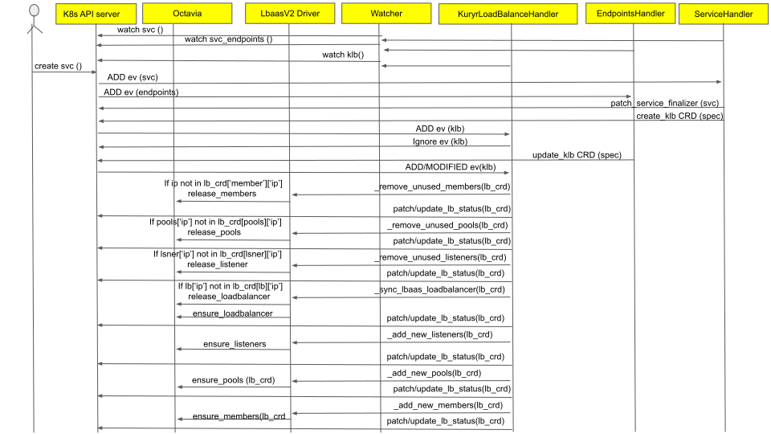

..
      This work is licensed under a Creative Commons Attribution 3.0 Unported
      License.

      http://creativecommons.org/licenses/by/3.0/legalcode

      Convention for heading levels in Neutron devref:
      =======  Heading 0 (reserved for the title in a document)
      -------  Heading 1
      ~~~~~~~  Heading 2
      +++++++  Heading 3
      '''''''  Heading 4
      (Avoid deeper levels because they do not render well.)

============================================
Kuryr Kubernetes Services Integration Design
============================================

Purpose
-------

The purpose of this document is to present how Kubernetes Service is supported
by the kuryr integration and to capture the design decisions currently taken
by the kuryr team.

Overview
--------

A Kubernetes Service is an abstraction which defines a logical set of Pods and
a policy by which to access them. Service is a Kubernetes managed API object.
For Kubernetes-native applications, Kubernetes offers an Endpoints API that is
updated whenever the set of Pods in a Service changes. For detailed information
please refer to `Kubernetes service`_. Kubernetes supports services with
kube-proxy component that runs on each node, `Kube-Proxy`_.

Proposed Solution
-----------------

Kubernetes service in its essence is a Load Balancer across Pods that fit the
service selection. Kuryr's choice is to support Kubernetes services by using
Neutron LBaaS service. The initial implementation is based on the OpenStack
LBaaSv2 API, so compatible with any LBaaSv2 API provider.

In order to be compatible with Kubernetes networking, Kuryr-Kubernetes makes
sure that services Load Balancers have access to Pods Neutron ports. This may
be affected once Kubernetes Network Policies will be supported. Oslo versioned
objects are used to keep translation details in Kubernetes entities annotation.
This will allow future changes to be backward compatible.

Data Model Translation
~~~~~~~~~~~~~~~~~~~~~~

Kubernetes service is mapped to the LBaaSv2 Load Balancer with associated
Listeners and Pools. Service endpoints are mapped to Load Balancer Pool
members.

Kuryr Controller Impact
~~~~~~~~~~~~~~~~~~~~~~~

Three Kubernetes Event Handlers are added to the Controller pipeline.

- ServiceHandler manages Kubernetes Service events.
  Based on the service spec and metadata details, it creates KuryrLoadBalancer
  CRD or it updates the CRD, more specifically the spec part of the CRD with
  details to be used for translation to LBaaSv2 model, such as tenant-id,
  subnet-id, ip address and security groups.
- EndpointsHandler is responsible for adding endpoints subsets to the
  KuryrLoadBalancer CRD. If endpoint is created before Service, this handler
  creates the CRD with the endpoints subsets, otherwise the existent CRD is
  updated.
- KuryrLoadBalancerHandler manages KuryrLoadBalancer CRD events when the CRD is
  successfully created and filled with spec data. This handler is responsible
  for creating the needed Octavia resources according to the CRD spec and
  update the status field with information about the generated resources, such
  as LoadBalancer, LoadBalancerListener, LoadBalancerPool and
  LoadBalancerMembers.

These Handlers use Project, Subnet and SecurityGroup service drivers to get
details for service mapping.

In order to prevent Kubernetes objects from being deleted before the OpenStack
resources are cleaned up, finalizers are used. Finalizers block deletion of the
Service, Endpoints and KuryrLoadBalancer objects until Kuryr deletes the
associated OpenStack loadbalancers. After that the finalizers are removed
allowing the Kubernetes API to delete the objects.

LBaaS Driver is added to manage service translation to the LBaaSv2-like API. It
abstracts all the details of service translation to Load Balancer.
LBaaSv2Driver supports this interface by mapping to neutron LBaaSv2 constructs.

Service Creation Process
~~~~~~~~~~~~~~~~~~~~~~~~

What happens when a service gets created by Kubernetes?
+++++++++++++++++++++++++++++++++++++++++++++++++++++++

When a Kubernetes Service and Endpoints are created,the ServiceHandler and
EndpointHandler (at controller/handlers/lbaas.py) are called. When the
ServiceHandler first starts handling the on_present event, it creates the
KuryrLoadBalancer CRD with the Service spec and empty status. When the
Endpoints information is not yet added on the spec by the EndpointHandler, the
event reaching KuryrLoadBalancerHandler is skipped. If the EndpointsHandler
starts handling the on_present event first, the KuryrLoadBalancer CRD is
created with the endpoints subsets. Otherwise, it will update the existing CRD
created by the ServiceHandler with the endpoints subsets.

The KuryrLoadBalancerHandler (at controller/handlers/loadbalancer.py) upon
noticing the KuryrLoadBalancer CRD with the full specification, calls the
appropriate Drivers to handle the openstack resources such as Loadbalancer,
Load Balancer Listeners, Load Balancer Pools, and Load Balancer Members. It
uses the _sync_lbaas_members function to check if Openstack Loadbalancers are
in sync with the kubernetes counterparts.

   Service creation flow diagram

Service Deletion Process
~~~~~~~~~~~~~~~~~~~~~~~~

What happens when a service gets deleted by Kubernetes?
+++++++++++++++++++++++++++++++++++++++++++++++++++++++

When a Kubernetes Service and Endpoints are deleted, the finalizers which are
added to the service object (and the KLB CRD Object too) and defined during the
KuryrLoadBalancer CRD creation, blocks the removal of the kubernetes object
until the associated OpenStack resources are removed, which also avoids
leftovers. When they are removed, Kubernetes is able to remove the CRD, the
service and the endpoints, hence completing the service removal action.

What happens if the KuryrLoadBalancer CRD status changes?
+++++++++++++++++++++++++++++++++++++++++++++++++++++++++

If the members field on the status of the CRD is manually removed or the status
is completely set to an empty object, the KuryrLoadBalancerHandler that is
watching these CRD objects detects this change and confirms that there is no
information about the OpenStack resources on the status and so needs to
rediscover or recreate them. It checks if there are provisioned OpenStack
resources (in this case loadbalancers, listeners, pools, and members) for the
service/endpoints defined on the KuryrLoadBalancer CRD spec. If that is the
case, it retrieves their information and puts it back on the CRD status field.
If that is not the case (due to the resources being deleted on the OpenStack
side), it will recreate the resources and write the new information about them
on the CRD status field.

.. _Kubernetes service: http://kubernetes.io/docs/user-guide/services/
.. _Kube-Proxy: http://kubernetes.io/docs/admin/kube-proxy/
