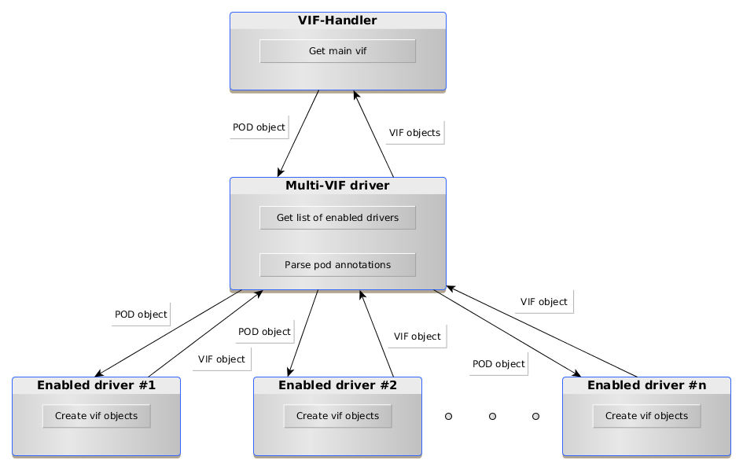

..
    This work is licensed under a Creative Commons Attribution 3.0 Unported
    License.

    http://creativecommons.org/licenses/by/3.0/legalcode

    Convention for heading levels in Neutron devref:
    =======  Heading 0 (reserved for the title in a document)
    -------  Heading 1
    ~~~~~~~  Heading 2
    +++++++  Heading 3
    '''''''  Heading 4
    (Avoid deeper levels because they do not render well.)

==================================
VIF-Handler And Vif Drivers Design
==================================

Purpose
-------
The purpose of this document is to present an approach for implementing
design of interaction between VIF-handler and the drivers it uses in
Kuryr-Kubernetes Controller.

VIF-Handler
-----------
VIF-handler is intended to handle VIFs. The main aim of VIF-handler is to get
the pod object, send it to 1) the VIF-driver for the default network, 2)
enabled Multi-VIF drivers for the additional networks, and get VIF objects
from both. After that VIF-handler is able to activate, release or update VIFs.
VIF-handler should stay clean whereas parsing of specific pod information
should be done by Multi-VIF drivers.

Multi-VIF driver
~~~~~~~~~~~~~~~~
The new type of drivers which is used to call other VIF-drivers to attach
additional interfaces to Pods. The main aim of this kind of drivers is to get
additional interfaces from the Pods definition, then invoke real VIF-drivers
like neutron-vif, nested-macvlan or sriov to retrieve the VIF objects
accordingly.

All Multi-VIF drivers should be derived from class *MultiVIFDriver*. And all
should implement the *request_additional_vifs* method which returns a list of
VIF objects. Those VIF objects are created by each of the vif-drivers invoked
by the Multi-VIF driver. Each of the multi-vif driver should support a syntax
of additional interfaces definition in Pod. If the pod object doesn't define
additional interfaces, the Multi-VIF driver can just return.

Diagram describing VifHandler - Drivers flow is giver below:

Config Options
~~~~~~~~~~~~~~
Add new config option "multi_vif_drivers" (list) to config file that shows
what Multi-VIF drivers should be used in to specify the addition VIF objects.
It is allowed to have one or more multi_vif_drivers enabled, which means that
multi_vif_drivers can either work separately or together. By default, a noop
driver which basically does nothing will be used if this field is not
explicitly specified.

Option in config file might look like this:

.. code-block:: ini

    [kubernetes]

    multi_vif_drivers =  sriov, additional_subnets

Or like this:

.. code-block:: ini

    [kubernetes]

    multi_vif_drivers =  npwg_multiple_interfaces

Additional Subnets Driver
~~~~~~~~~~~~~~~~~~~~~~~~~
Since it is possible to request additional subnets for the pod through the pod
annotations it is necessary to have new driver. According to parsed information
(requested subnets) by Multi-vif driver it has to return dictionary containing
the mapping 'subnet_id' -> 'network' for all requested subnets in unified format
specified in PodSubnetsDriver class.
Here's how a Pod Spec with additional subnets requests might look like:

.. code-block:: yaml

    spec:
      replicas: 1
      template:
        metadata:
          name: some-name
          labels:
            app: some-name
          annotations:
            openstack.org/kuryr-additional-subnets: '[
                "id_of_neutron_subnet_created_previously"
            ]'

SRIOV Driver
~~~~~~~~~~~~
SRIOV driver gets pod object from Multi-vif driver, according to parsed
information (sriov requests) by Multi-vif driver. It should return a list of
created vif objects. Method request_vif() has unified interface with
PodVIFDriver as a base class.
Here's how a Pod Spec with sriov requests might look like:

.. code-block:: yaml

    spec:
      containers:
      - name: vf-container
        image: vf-image
        resources:
          requests:
            pod.alpha.kubernetes.io/opaque-int-resource-sriov-vf-physnet2: 1

Specific ports support
----------------------
Specific ports support is enabled by default and will be a part of the drivers
to implement it. It is possile to have manually precreated specific ports in
neutron and specify them in pod annotations as preferably used. This means that
drivers will use specific ports if it is specified in pod annotations, otherwise
it will create new ports by default. It is important that specific ports can have
vnic_type both direct and normal, so it is necessary to provide processing
support for specific ports in both SRIOV and generic driver.
Pod annotation with requested specific ports might look like this:

.. code-block:: yaml

    spec:
      replicas: 1
      template:
        metadata:
          name: some-name
          labels:
            app: some-name
          annotations:
            spec-ports: '[
                "id_of_direct_precreated_port".
                "id_of_normal_precreated_port"
            ]'

Pod spec above should be interpreted the following way:
Multi-vif driver parses pod annotations and gets ids of specific ports.
If vnic_type is "normal" and such ports exist, it calls generic driver to create vif
objects for these ports. Else if vnic_type is "direct" and such ports exist, it calls
sriov driver to create vif objects for these ports. If certain ports are not
requested in annotations then driver doesn't return additional vifs to Multi-vif
driver.
