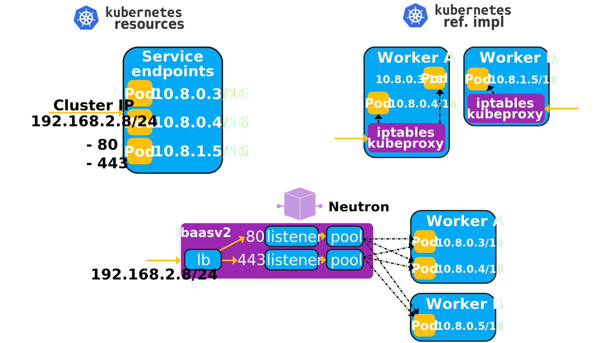

==============================
Kubernetes services networking
==============================

Kuryr-Kubernetes default handler for handling Kubernetes `services`_ and
endpoints uses the OpenStack `Octavia API`_ in order to have each service
be implemented in the following way:

* **Service**: It is translated to a single **LoadBalancer** and as many
  **Listeners** and **Pools** as ports the Kubernetes Service spec defines.
* **ClusterIP**: It is translated to a LoadBalancer's VIP.
* **loadBalancerIP**: Translated to public IP associated with the
  LoadBalancer's VIP.
* **Endpoints**: The Endpoint object is translated to a LoadBalancer's VIP.

   In this diagram you can see how the Kubernetes entities in the top left
   corner are implemented in plain Kubernetes networking (top-right) and in
   Kuryr's default configuration (bottom)

If you are paying attention and are familiar with the `Octavia API`_ you
probably noticed that we have separate pools for each exposed port in a
service. This is probably not optimal and we would probably benefit from
keeping a single Neutron pool that lists each of the per port listeners.

Kuryr-Kubernetes uses OpenStack Octavia as the load balancing solution for
OpenStack and to provide connectivity to the Kubernetes Services.

It is beyond the scope of this document to explain in detail the inner
workings of Openstack Octavia thus, only a brief explanation will be offered.

Octavia
-------

OpenStack Octavia is a project that provides advanced Load Balancing by using
pre-existing OpenStack services. The requirements for running Kuryr with
OpenStack Octavia are the following:

* Nova
* Neutron
* Glance
* Barbican (if TLS offloading functionality is enabled)
* Keystone
* Rabbit
* MySQL

You can find a good explanation about the involved steps to install Octavia in
the `Octavia installation docs`_.

Simplifying a lot, Octavia works by instantiating a compute resource, i.e. a
Nova VM, and running HAProxy inside. These single load balancer Nova VMs are
called *Amphorae*. Each *Amphora* has a separate linux network namespace where
HAProxy runs and that is connected to the Kuryr services network. The VM host
network namespace is used by Octavia to reconfigure and monitor the Load
Balancer, which it talks to via HAProxy's control unix domain socket.

Running Kuryr with Octavia means that each Kubernetes service that runs in the
cluster will need at least one Load Balancer VM, i.e., an *Amphora*.  To avoid
single point of failure at Amphora, Octavia should be configured to support
active/standby loadbalancer topology.  In addition, it is important to
configure the right Octavia flavor for your deployment and to size the compute
nodes appropriately so that Octavia can operate well.

Another important consideration is where do the Amphorae run, i.e., whether the
worker nodes should also be compute nodes so that they run the Amphorae or if
Amphorae should be run separately. If your compute nodes are big enough, it
would help avoiding extra hops if the amphorae were scheduled in the worker
nodes, but how much significant that is, depends on your latency and throughput
requirements.

Octavia uses `Load Balancer drivers`_ to handle all communications with
*Amphorae*. By default, Kuryr-Kubernetes uses the reference Octavia driver
which is the `Amphora driver`_. Kuryr also supports the use of
`OVN Octavia driver`_.

OVN Octavia Provider Driver
---------------------------

Kuryr supports the creation of a load balancer with OVN provider driver. When
'ovn' provider is enabled as one of the Octavia Load Balancer providers, the
load balancing is executed by the virtual switch data-path engine and there is
no need to create VMs. This means there is no additional overhead of VMs as is
required when using Octavia with the default Amphora driver.

You can find additional information about the driver, its limitations and how
to create OVN-based load balancers in `OVN as Provider Driver for Octavia`_.

.. _k8s_default_configuration:

Default configuration
~~~~~~~~~~~~~~~~~~~~~

Kuryr can use Octavia in two ways:

* The one that is commonly referred to as **Layer 3**, this means that Kuryr
  will tell Octavia not to add a Neutron port to the pod network for each
  load balancer. Instead, **it relies on the pod and the service subnets being
  routable**. This means that the communication from Pods to Services and back
  will go through the router. Depending on the SDN of your choice, this may
  have performance implications.
* The **Layer 2** way, where kuryr will tell Octavia to add a Neutron port to
  the pod network for each load balancer. Therefore the communication from
  Services to its Pods members and back will go directly through L2 layer. The
  drawback of this approach is the extra usage of neutron ports in the Pods
  subnet, that needs to be accordingly dimensioned.

The services and pods subnets should be created.

#. Create pod network:

   .. code-block:: console

      $ openstack network create pod
      +---------------------------+--------------------------------------+
      | Field                     | Value                                |
      +---------------------------+--------------------------------------+
      | admin_state_up            | UP                                   |
      | availability_zone_hints   |                                      |
      | availability_zones        |                                      |
      | created_at                | 2017-08-11T10:51:25Z                 |
      | description               |                                      |
      | dns_domain                | None                                 |
      | id                        | 4593045c-4233-4b4c-8527-35608ab0eaae |
      | ipv4_address_scope        | None                                 |
      | ipv6_address_scope        | None                                 |
      | is_default                | False                                |
      | is_vlan_transparent       | None                                 |
      | mtu                       | 1450                                 |
      | name                      | pod                                  |
      | port_security_enabled     | True                                 |
      | project_id                | 90baf12877ba49a786419b2cacc2c954     |
      | provider:network_type     | vxlan                                |
      | provider:physical_network | None                                 |
      | provider:segmentation_id  | 21                                   |
      | qos_policy_id             | None                                 |
      | revision_number           | 2                                    |
      | router:external           | Internal                             |
      | segments                  | None                                 |
      | shared                    | False                                |
      | status                    | ACTIVE                               |
      | subnets                   |                                      |
      | tags                      | []                                   |
      | updated_at                | 2017-08-11T10:51:25Z                 |
      +---------------------------+--------------------------------------+

#. Create pod subnet:

   .. code-block:: console

      $ openstack subnet create --network pod --no-dhcp \
          --gateway 10.1.255.254 \
          --subnet-range 10.1.0.0/16 \
          pod_subnet
      +-------------------------+--------------------------------------+
      | Field                   | Value                                |
      +-------------------------+--------------------------------------+
      | allocation_pools        | 10.1.0.1-10.1.255.253                |
      | cidr                    | 10.1.0.0/16                          |
      | created_at              | 2017-08-11T10:55:25Z                 |
      | description             |                                      |
      | dns_nameservers         |                                      |
      | enable_dhcp             | False                                |
      | gateway_ip              | 10.1.255.254                         |
      | host_routes             |                                      |
      | id                      | e0a888ab-9915-4685-a600-bffe240dc58b |
      | ip_version              | 4                                    |
      | ipv6_address_mode       | None                                 |
      | ipv6_ra_mode            | None                                 |
      | name                    | pod_subnet                           |
      | network_id              | 4593045c-4233-4b4c-8527-35608ab0eaae |
      | project_id              | 90baf12877ba49a786419b2cacc2c954     |
      | revision_number         | 0                                    |
      | segment_id              | None                                 |
      | service_types           |                                      |
      | subnetpool_id           | None                                 |
      | tags                    | []                                   |
      | updated_at              | 2017-08-11T10:55:25Z                 |
      | use_default_subnet_pool | None                                 |
      +-------------------------+--------------------------------------+

#. Create services network:

   .. code-block:: console

      $ openstack network create services
      +---------------------------+--------------------------------------+
      | Field                     | Value                                |
      +---------------------------+--------------------------------------+
      | admin_state_up            | UP                                   |
      | availability_zone_hints   |                                      |
      | availability_zones        |                                      |
      | created_at                | 2017-08-11T10:53:36Z                 |
      | description               |                                      |
      | dns_domain                | None                                 |
      | id                        | 560df0c2-537c-41c0-b22c-40ef3d752574 |
      | ipv4_address_scope        | None                                 |
      | ipv6_address_scope        | None                                 |
      | is_default                | False                                |
      | is_vlan_transparent       | None                                 |
      | mtu                       | 1450                                 |
      | name                      | services                             |
      | port_security_enabled     | True                                 |
      | project_id                | 90baf12877ba49a786419b2cacc2c954     |
      | provider:network_type     | vxlan                                |
      | provider:physical_network | None                                 |
      | provider:segmentation_id  | 94                                   |
      | qos_policy_id             | None                                 |
      | revision_number           | 2                                    |
      | router:external           | Internal                             |
      | segments                  | None                                 |
      | shared                    | False                                |
      | status                    | ACTIVE                               |
      | subnets                   |                                      |
      | tags                      | []                                   |
      | updated_at                | 2017-08-11T10:53:37Z                 |
      +---------------------------+--------------------------------------+

#. Create service subnet. We reserve the first half of the subnet range for the
   VIPs and the second half for the loadbalancer vrrp ports:

   .. code-block:: console

      $ openstack subnet create --network services --no-dhcp \
          --gateway 10.2.255.254 \
          --ip-version 4 \
          --allocation-pool start=10.2.128.1,end=10.2.255.253 \
          --subnet-range 10.2.0.0/16 \
          service_subnet
      +-------------------------+--------------------------------------+
      | Field                   | Value                                |
      +-------------------------+--------------------------------------+
      | allocation_pools        | 10.2.128.1-10.2.255.253              |
      | cidr                    | 10.2.0.0/16                          |
      | created_at              | 2017-08-11T11:02:24Z                 |
      | description             |                                      |
      | dns_nameservers         |                                      |
      | enable_dhcp             | False                                |
      | gateway_ip              | 10.2.255.254                         |
      | host_routes             |                                      |
      | id                      | d6438a81-22fa-4a88-9b05-c4723662ef36 |
      | ip_version              | 4                                    |
      | ipv6_address_mode       | None                                 |
      | ipv6_ra_mode            | None                                 |
      | name                    | service_subnet                       |
      | network_id              | 560df0c2-537c-41c0-b22c-40ef3d752574 |
      | project_id              | 90baf12877ba49a786419b2cacc2c954     |
      | revision_number         | 0                                    |
      | segment_id              | None                                 |
      | service_types           |                                      |
      | subnetpool_id           | None                                 |
      | tags                    | []                                   |
      | updated_at              | 2017-08-11T11:02:24Z                 |
      | use_default_subnet_pool | None                                 |
      +-------------------------+--------------------------------------+

#. Create a router to give L3 connectivity between the pod and the service
   subnets. If you already have one, you can use it:

   .. code-block:: console

      $ openstack router create kuryr-kubernetes
      +-------------------------+--------------------------------------+
      | Field                   | Value                                |
      +-------------------------+--------------------------------------+
      | admin_state_up          | UP                                   |
      | availability_zone_hints |                                      |
      | availability_zones      |                                      |
      | created_at              | 2017-08-11T11:06:21Z                 |
      | description             |                                      |
      | distributed             | False                                |
      | external_gateway_info   | None                                 |
      | flavor_id               | None                                 |
      | ha                      | False                                |
      | id                      | d2a06d95-8abd-471b-afbe-9dfe475dd8a4 |
      | name                    | kuryr-kubernetes                     |
      | project_id              | 90baf12877ba49a786419b2cacc2c954     |
      | revision_number         | None                                 |
      | routes                  |                                      |
      | status                  | ACTIVE                               |
      | tags                    | []                                   |
      | updated_at              | 2017-08-11T11:06:21Z                 |
      +-------------------------+--------------------------------------+

#. Create router ports in the pod and service subnets:

   .. code-block:: console

      $ openstack port create --network pod --fixed-ip ip-address=10.1.255.254 pod_subnet_router
      +-----------------------+---------------------------------------------------------------------------+
      | Field                 | Value                                                                     |
      +-----------------------+---------------------------------------------------------------------------+
      | admin_state_up        | UP                                                                        |
      | allowed_address_pairs |                                                                           |
      | binding_host_id       |                                                                           |
      | binding_profile       |                                                                           |
      | binding_vif_details   |                                                                           |
      | binding_vif_type      | unbound                                                                   |
      | binding_vnic_type     | normal                                                                    |
      | created_at            | 2017-08-11T11:10:47Z                                                      |
      | data_plane_status     | None                                                                      |
      | description           |                                                                           |
      | device_id             |                                                                           |
      | device_owner          |                                                                           |
      | dns_assignment        | None                                                                      |
      | dns_name              | None                                                                      |
      | extra_dhcp_opts       |                                                                           |
      | fixed_ips             | ip_address='10.1.255.254', subnet_id='e0a888ab-9915-4685-a600-bffe240dc58b' |
      | id                    | 0a82dfff-bf45-4738-a1d2-36d4ad81a5fd                                      |
      | ip_address            | None                                                                      |
      | mac_address           | fa:16:3e:49:70:b5                                                         |
      | name                  | pod_subnet_router                                                         |
      | network_id            | 4593045c-4233-4b4c-8527-35608ab0eaae                                      |
      | option_name           | None                                                                      |
      | option_value          | None                                                                      |
      | port_security_enabled | True                                                                      |
      | project_id            | 90baf12877ba49a786419b2cacc2c954                                          |
      | qos_policy_id         | None                                                                      |
      | revision_number       | 3                                                                         |
      | security_group_ids    | 2d6e006e-572a-4939-93b8-0f45b40777f7                                      |
      | status                | DOWN                                                                      |
      | subnet_id             | None                                                                      |
      | tags                  | []                                                                        |
      | trunk_details         | None                                                                      |
      | updated_at            | 2017-08-11T11:10:47Z                                                      |
      +-----------------------+---------------------------------------------------------------------------+

      $ openstack port create --network services \
            --fixed-ip ip-address=10.2.255.254 \
            service_subnet_router
      +-----------------------+-----------------------------------------------------------------------------+
      | Field                 | Value                                                                       |
      +-----------------------+-----------------------------------------------------------------------------+
      | admin_state_up        | UP                                                                          |
      | allowed_address_pairs |                                                                             |
      | binding_host_id       |                                                                             |
      | binding_profile       |                                                                             |
      | binding_vif_details   |                                                                             |
      | binding_vif_type      | unbound                                                                     |
      | binding_vnic_type     | normal                                                                      |
      | created_at            | 2017-08-11T11:16:56Z                                                        |
      | data_plane_status     | None                                                                        |
      | description           |                                                                             |
      | device_id             |                                                                             |
      | device_owner          |                                                                             |
      | dns_assignment        | None                                                                        |
      | dns_name              | None                                                                        |
      | extra_dhcp_opts       |                                                                             |
      | fixed_ips             | ip_address='10.2.255.254', subnet_id='d6438a81-22fa-4a88-9b05-c4723662ef36' |
      | id                    | 572cee3d-c30a-4ee6-a59c-fe9529a6e168                                        |
      | ip_address            | None                                                                        |
      | mac_address           | fa:16:3e:65:de:e5                                                           |
      | name                  | service_subnet_router                                                       |
      | network_id            | 560df0c2-537c-41c0-b22c-40ef3d752574                                        |
      | option_name           | None                                                                        |
      | option_value          | None                                                                        |
      | port_security_enabled | True                                                                        |
      | project_id            | 90baf12877ba49a786419b2cacc2c954                                            |
      | qos_policy_id         | None                                                                        |
      | revision_number       | 3                                                                           |
      | security_group_ids    | 2d6e006e-572a-4939-93b8-0f45b40777f7                                        |
      | status                | DOWN                                                                        |
      | subnet_id             | None                                                                        |
      | tags                  | []                                                                          |
      | trunk_details         | None                                                                        |
      | updated_at            | 2017-08-11T11:16:57Z                                                        |
      +-----------------------+-----------------------------------------------------------------------------+

#. Add the router to the service and the pod subnets:

   .. code-block:: console

      $ openstack router add port \
            d2a06d95-8abd-471b-afbe-9dfe475dd8a4 \
            0a82dfff-bf45-4738-a1d2-36d4ad81a5fd

      $ openstack router add port \
            d2a06d95-8abd-471b-afbe-9dfe475dd8a4 \
            572cee3d-c30a-4ee6-a59c-fe9529a6e168

#. Configure kuryr.conf pod subnet and service subnet to point to their
   respective subnets created in step (2) and (4):

   .. code-block:: ini

      [neutron_defaults]
      pod_subnet = e0a888ab-9915-4685-a600-bffe240dc58b
      service_subnet = d6438a81-22fa-4a88-9b05-c4723662ef36

#. Configure Kubernetes API server to use only a subset of the service
   addresses, **10.2.0.0/17**. The rest will be used for loadbalancer *vrrp*
   ports managed by Octavia. To configure Kubernetes with this CIDR range you
   have to add the following parameter to its command line invocation:

   .. code-block:: console

      --service-cluster-ip-range=10.2.0.0/17

   As a result of this, Kubernetes will allocate the **10.2.0.1** address to
   the Kubernetes API service, i.e., the service used for pods to talk to the
   Kubernetes API server. It will be able to allocate service addresses up
   until **10.2.127.254**. The rest of the addresses, as stated above, will be
   for Octavia load balancer *vrrp* ports. **If this subnetting was not done,
   Octavia would allocate *vrrp* ports with the Neutron IPAM from the same
   range as Kubernetes service IPAM and we'd end up with conflicts**.

#. Once you have Kubernetes installed and you have the API host reachable from
   the pod subnet, follow the `Making the Pods be able to reach the Kubernetes
   API`_ section

#. For the external services (type=LoadBalancer) case,
   two methods are supported:

   + Pool - external IPs are allocated from pre-defined pool
   + User - user specify the external IP address

   In case 'Pool' method should be supported, execute the next steps:

   #. Create an external/provider network
   #. Create subnet/pool range of external CIDR
   #. Connect external subnet to kuryr-kubernetes router
   #. Configure external network details in Kuryr.conf as follows:

      .. code-block:: ini

         [neutron_defaults]
         external_svc_net= <id of external network>
         # 'external_svc_subnet' field is optional, set this field in case
         # multiple subnets attached to 'external_svc_net'
         external_svc_subnet= <id of external subnet>

   From this point for each K8s service of type=LoadBalancer and in which
   'load-balancer-ip' is not specified, an external IP from
   'external_svc_subnet' will be allocated.

   For the 'User' case, user should first create an external/floating IP:

   .. code-block:: console

      $ #openstack floating ip create --subnet <ext-subnet-id> <ext-netowrk-id>
      $ openstack floating ip create --subnet 48ddcfec-1b29-411b-be92-8329cc09fc12  3b4eb25e-e103-491f-a640-a6246d588561
      +---------------------------+--------------------------------------+
      | Field               | Value                                |
      +---------------------+--------------------------------------+
      | created_at          | 2017-10-02T09:22:37Z                 |
      | description         |                                      |
      | fixed_ip_address    | None                                 |
      | floating_ip_address | 172.24.4.13                          |
      | floating_network_id | 3b4eb25e-e103-491f-a640-a6246d588561 |
      | id                  | 1157e2fd-de64-492d-b955-88ea203b4c37 |
      | name                | 172.24.4.13                          |
      | port_id             | None                                 |
      | project_id          | 6556471f4f7b40e2bde1fc6e4aba0eef     |
      | revision_number     | 0                                    |
      | router_id           | None                                 |
      | status              | DOWN                                 |
      | updated_at          | 2017-10-02T09:22:37Z                 |
      +---------------------+--------------------------------------+

  and then create k8s service with type=LoadBalancer and
  load-balancer-ip=<floating_ip> (e.g: 172.24.4.13)

  In both 'User' and 'Pool' methods, the external IP address could be found
  in k8s service status information (under loadbalancer/ingress/ip)

Alternative configuration
~~~~~~~~~~~~~~~~~~~~~~~~~

It is actually possible to avoid this routing by performing a deployment change
that was successfully pioneered by the people at EasyStack Inc. which consists
of doing the following:

#. Create the pod network and subnet so that it has enough addresses for both
   the pod ports and the service ports. We are limiting the allocation range
   out of the service range so that nor Octavia nor Kuryr-Kubernetes pod
   allocation create ports in the part reserved for services.

   Create the network:

   .. code-block:: console

      $ openstack network create k8s
      +---------------------------+--------------------------------------+
      | Field                     | Value                                |
      +---------------------------+--------------------------------------+
      | admin_state_up            | UP                                   |
      | availability_zone_hints   |                                      |
      | availability_zones        |                                      |
      | created_at                | 2017-08-10T15:58:19Z                 |
      | description               |                                      |
      | dns_domain                | None                                 |
      | id                        | 9fa35362-0bf7-4b5b-8921-f0c7f60a7dd3 |
      | ipv4_address_scope        | None                                 |
      | ipv6_address_scope        | None                                 |
      | is_default                | False                                |
      | is_vlan_transparent       | None                                 |
      | mtu                       | 1450                                 |
      | name                      | k8s                                  |
      | port_security_enabled     | True                                 |
      | project_id                | 90baf12877ba49a786419b2cacc2c954     |
      | provider:network_type     | vxlan                                |
      | provider:physical_network | None                                 |
      | provider:segmentation_id  | 69                                   |
      | qos_policy_id             | None                                 |
      | revision_number           | 2                                    |
      | router:external           | Internal                             |
      | segments                  | None                                 |
      | shared                    | False                                |
      | status                    | ACTIVE                               |
      | subnets                   |                                      |
      | tags                      | []                                   |
      | updated_at                | 2017-08-10T15:58:20Z                 |
      +---------------------------+--------------------------------------+

   Create the subnet. Note that we disable dhcp as Kuryr-Kubernetes pod subnets
   have no need for them for Pod networking. We also put the gateway on the
   last IP of the subnet range so that the beginning of the range can be kept
   for Kubernetes driven service IPAM:

   .. code-block:: console

      $ openstack subnet create --network k8s --no-dhcp \
          --gateway 10.0.255.254 \
          --ip-version 4 \
          --allocation-pool start=10.0.64.0,end=10.0.255.253 \
          --subnet-range 10.0.0.0/16 \
          k8s_subnet
      +-------------------------+--------------------------------------+
      | Field                   | Value                                |
      +-------------------------+--------------------------------------+
      | allocation_pools        | 10.0.64.0-10.0.255.253               |
      | cidr                    | 10.0.0.0/16                          |
      | created_at              | 2017-08-10T16:07:11Z                 |
      | description             |                                      |
      | dns_nameservers         |                                      |
      | enable_dhcp             | False                                |
      | gateway_ip              | 10.0.255.254                         |
      | host_routes             |                                      |
      | id                      | 3a1df0d9-f738-4293-8de6-6c624f742980 |
      | ip_version              | 4                                    |
      | ipv6_address_mode       | None                                 |
      | ipv6_ra_mode            | None                                 |
      | name                    | k8s_subnet                           |
      | network_id              | 9fa35362-0bf7-4b5b-8921-f0c7f60a7dd3 |
      | project_id              | 90baf12877ba49a786419b2cacc2c954     |
      | revision_number         | 0                                    |
      | segment_id              | None                                 |
      | service_types           |                                      |
      | subnetpool_id           | None                                 |
      | tags                    | []                                   |
      | updated_at              | 2017-08-10T16:07:11Z                 |
      | use_default_subnet_pool | None                                 |
      +-------------------------+--------------------------------------+

#. Configure kuryr.conf pod subnet and service subnet to point to the same
   subnet created in step (1):

   .. code-block:: ini

      [neutron_defaults]
      pod_subnet = 3a1df0d9-f738-4293-8de6-6c624f742980
      service_subnet = 3a1df0d9-f738-4293-8de6-6c624f742980

#. Configure Kubernetes API server to use only a subset of the addresses for
   services, **10.0.0.0/18**. The rest will be used for pods. To configure
   Kubernetes with this CIDR range you have to add the following parameter to
   its command line invocation:

   .. code-block:: console

      --service-cluster-ip-range=10.0.0.0/18

   As a result of this, Kubernetes will allocate the **10.0.0.1** address to
   the Kubernetes API service, i.e., the service used for pods to talk to the
   Kubernetes API server. It will be able to allocate service addresses up
   until **10.0.63.255**. The rest of the addresses will be for pods or Octavia
   load balancer *vrrp* ports.

#. Once you have Kubernetes installed and you have the API host reachable from
   the pod subnet, follow the `Making the Pods be able to reach the Kubernetes
   API`_ section

.. _k8s_lb_reachable:

Making the Pods be able to reach the Kubernetes API
---------------------------------------------------

Once you have Kubernetes installed and you have the API host reachable from the
pod subnet (that means you should add 10.0.255.254 to a router that gives
access to it), you should create a load balancer configuration for the
Kubernetes service to be accessible to Pods.

#. Create the load balancer (Kubernetes always picks the first address of the
   range we gave in *--service-cluster-ip-range*):

   .. code-block:: console

      $ openstack loadbalancer create --vip-address 10.0.0.1 \
           --vip-subnet-id 3a1df0d9-f738-4293-8de6-6c624f742980 \
           --name default/kubernetes
      +---------------------+--------------------------------------+
      | Field               | Value                                |
      +---------------------+--------------------------------------+
      | admin_state_up      | True                                 |
      | created_at          | 2017-08-10T16:16:30                  |
      | description         |                                      |
      | flavor              |                                      |
      | id                  | 84c1c0da-2065-43c5-86c9-f2235566b111 |
      | listeners           |                                      |
      | name                | default/kubernetes                   |
      | operating_status    | OFFLINE                              |
      | pools               |                                      |
      | project_id          | 90baf12877ba49a786419b2cacc2c954     |
      | provider            | octavia                              |
      | provisioning_status | PENDING_CREATE                       |
      | updated_at          | None                                 |
      | vip_Address         | 10.0.0.1                             |
      | vip_network_id      | 9fa35362-0bf7-4b5b-8921-f0c7f60a7dd3 |
      | vip_port_id         | d1182d33-686b-4bcc-9754-8d46e373d647 |
      | vip_subnet_id       | 3a1df0d9-f738-4293-8de6-6c624f742980 |
      +---------------------+--------------------------------------+

#. Create the Pool for all the Kubernetes API hosts:

   .. code-block:: console

      $ openstack loadbalancer pool create --name default/kubernetes:HTTPS:443 \
            --protocol HTTPS --lb-algorithm LEAST_CONNECTIONS \
            --loadbalancer 84c1c0da-2065-43c5-86c9-f2235566b111
      +---------------------+--------------------------------------+
      | Field               | Value                                |
      +---------------------+--------------------------------------+
      | admin_state_up      | True                                 |
      | created_at          | 2017-08-10T16:21:52                  |
      | description         |                                      |
      | healthmonitor_id    |                                      |
      | id                  | 22ae71be-1d71-4a6d-9dd8-c6a4f8e87061 |
      | lb_algorithm        | LEAST_CONNECTIONS                    |
      | listeners           |                                      |
      | loadbalancers       | 84c1c0da-2065-43c5-86c9-f2235566b111 |
      | members             |                                      |
      | name                | default/kubernetes:HTTPS:443         |
      | operating_status    | OFFLINE                              |
      | project_id          | 90baf12877ba49a786419b2cacc2c954     |
      | protocol            | HTTPS                                |
      | provisioning_status | PENDING_CREATE                       |
      | session_persistence | None                                 |
      | updated_at          | None                                 |
      +---------------------+--------------------------------------+

#. Add a member for each Kubernetes API server. We recommend setting the name
   to be the hostname of the host where the Kubernetes API runs:

   .. code-block:: console

      $ openstack loadbalancer member create \
            --name k8s-master-0 \
            --address 192.168.1.2 \
            --protocol-port 6443 \
            22ae71be-1d71-4a6d-9dd8-c6a4f8e87061
      +---------------------+--------------------------------------+
      | Field               | Value                                |
      +---------------------+--------------------------------------+
      | address             | 192.168.1.2                          |
      | admin_state_up      | True                                 |
      | created_at          | 2017-08-10T16:40:57                  |
      | id                  | 9ba24740-3666-49e8-914d-233068de6423 |
      | name                | k8s-master-0                         |
      | operating_status    | NO_MONITOR                           |
      | project_id          | 90baf12877ba49a786419b2cacc2c954     |
      | protocol_port       | 6443                                 |
      | provisioning_status | PENDING_CREATE                       |
      | subnet_id           | None                                 |
      | updated_at          | None                                 |
      | weight              | 1                                    |
      | monitor_port        | None                                 |
      | monitor_address     | None                                 |
      +---------------------+--------------------------------------+

#. Create a listener for the load balancer that defaults to the created pool:

   .. code-block:: console

      $ openstack loadbalancer listener create \
            --name default/kubernetes:HTTPS:443 \
            --protocol HTTPS \
            --default-pool 22ae71be-1d71-4a6d-9dd8-c6a4f8e87061 \
            --protocol-port 443 \
            84c1c0da-2065-43c5-86c9-f2235566b111
      +---------------------------+--------------------------------------+
      | Field                     | Value                                |
      +---------------------------+--------------------------------------+
      | admin_state_up            | True                                 |
      | connection_limit          | -1                                   |
      | created_at                | 2017-08-10T16:46:55                  |
      | default_pool_id           | 22ae71be-1d71-4a6d-9dd8-c6a4f8e87061 |
      | default_tls_container_ref | None                                 |
      | description               |                                      |
      | id                        | f18b9af6-6336-4a8c-abe5-cb7b89c6b621 |
      | insert_headers            | None                                 |
      | l7policies                |                                      |
      | loadbalancers             | 84c1c0da-2065-43c5-86c9-f2235566b111 |
      | name                      | default/kubernetes:HTTPS:443         |
      | operating_status          | OFFLINE                              |
      | project_id                | 90baf12877ba49a786419b2cacc2c954     |
      | protocol                  | HTTPS                                |
      | protocol_port             | 443                                  |
      | provisioning_status       | PENDING_CREATE                       |
      | sni_container_refs        | []                                   |
      | updated_at                | 2017-08-10T16:46:55                  |
      +---------------------------+--------------------------------------+

.. _services_troubleshooting:

Troubleshooting
---------------

* **Pods can talk to each other with IPv6 but they can't talk to services.**

  This means that most likely you forgot to create a security group or rule
  for the pods to be accessible by the service CIDR. You can find an example
  here:

  .. code-block:: console

     $ openstack security group create service_pod_access
     +-----------------+-------------------------------------------------------------------------------------------------------------------------------------------------------+
     | Field           | Value                                                                                                                                                 |
     +-----------------+-------------------------------------------------------------------------------------------------------------------------------------------------------+
     | created_at      | 2017-08-16T10:01:45Z                                                                                                                                  |
     | description     | service_pod_access                                                                                                                                    |
     | id              | f0b6f0bd-40f7-4ab6-a77b-3cf9f7cc28ac                                                                                                                  |
     | name            | service_pod_access                                                                                                                                    |
     | project_id      | 90baf12877ba49a786419b2cacc2c954                                                                                                                      |
     | revision_number | 2                                                                                                                                                     |
     | rules           | created_at='2017-08-16T10:01:45Z', direction='egress', ethertype='IPv4', id='bd759b4f-c0f5-4cff-a30a-3cd8544d2822', updated_at='2017-08-16T10:01:45Z' |
     |                 | created_at='2017-08-16T10:01:45Z', direction='egress', ethertype='IPv6', id='c89c3f3e-a326-4902-ba26-5315e2d95320', updated_at='2017-08-16T10:01:45Z' |
     | updated_at      | 2017-08-16T10:01:45Z                                                                                                                                  |
     +-----------------+-------------------------------------------------------------------------------------------------------------------------------------------------------+

     $ openstack security group rule create --remote-ip 10.2.0.0/16 \
          --ethertype IPv4 f0b6f0bd-40f7-4ab6-a77b-3cf9f7cc28ac
     +-------------------+--------------------------------------+
     | Field             | Value                                |
     +-------------------+--------------------------------------+
     | created_at        | 2017-08-16T10:04:57Z                 |
     | description       |                                      |
     | direction         | ingress                              |
     | ether_type        | IPv4                                 |
     | id                | cface77f-666f-4a4c-8a15-a9c6953acf08 |
     | name              | None                                 |
     | port_range_max    | None                                 |
     | port_range_min    | None                                 |
     | project_id        | 90baf12877ba49a786419b2cacc2c954     |
     | protocol          | tcp                                  |
     | remote_group_id   | None                                 |
     | remote_ip_prefix  | 10.2.0.0/16                          |
     | revision_number   | 0                                    |
     | security_group_id | f0b6f0bd-40f7-4ab6-a77b-3cf9f7cc28ac |
     | updated_at        | 2017-08-16T10:04:57Z                 |
     +-------------------+--------------------------------------+

  Then remember to add the new security groups to the comma-separated
  *pod_security_groups* setting in the section *[neutron_defaults]* of
  /etc/kuryr/kuryr.conf. After making the kuryr.conf edits, you need to
  restart the kuryr controller for the changes to take effect.

  If you want your current pods to get this change applied, the most
  comfortable way to do that is to delete them and let the Kubernetes
  Deployment create them automatically for you.

.. _services: https://kubernetes.io/docs/concepts/services-networking/service/
.. _Octavia API: https://docs.openstack.org/api-ref/load-balancer/v2/
.. _Octavia installation docs: https://docs.openstack.org/octavia/latest/contributor/guides/dev-quick-start.html
.. _Load Balancer drivers: https://docs.openstack.org/octavia/latest/
.. _Amphora driver: https://docs.openstack.org/octavia/latest/
.. _OVN Octavia driver: https://docs.openstack.org/ovn-octavia-provider/latest/
.. _OVN as Provider Driver for Octavia: https://docs.openstack.org/networking-ovn/stein/admin/loadbalancer.html
