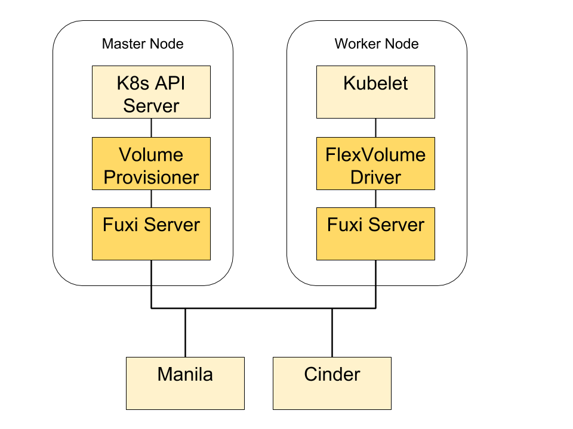

..
 This work is licensed under a Creative Commons Attribution 3.0 Unported
 License.

 http://creativecommons.org/licenses/by/3.0/legalcode

===========================
Fuxi Kubernetes Integration
===========================

https://blueprints.launchpad.net/kuryr-kubernetes/+spec/fuxi-kubernetes

This spec proposes an approach to integrate Kubernetes with various OpenStack
storage services, such as Cinder, Manila.

Kubernetes is a platform for automating deployment, scaling and operations of
application containers across clusters of hosts. Kubernetes currently supports
Cinder plugin that manages Cinder volumes and makes them available for pods.
In addition, there are a number of third-party implementations of Kubernetes
volume plugins (i.e. Flocker, REX-Ray) that allows Kubernetes to manage volumes
backed by various cloud storage providers including OpenStack Cinder. All these
solutions are mainly for overcloud use cases, in which pods are deployed on
a set of cloud instances. In production, there is another class of use cases,
that were referred as the undercloud use cases, in which Kubernetes are
deployed as a control plane service and pods are running on servers other
than cloud instances (i.e. baremetal servers).

This spec proposed a solution that will address both overcloud and undercloud
use cases. The specific requirements are as follows:

- Integrate Kubernetes with various OpenStack storage services, such as Cinder
  and Manila.
- Support various backends that are supported by the OpenStack storage
  services.
- Support various volumes operations including but not limiting to provision,
  de-provision, attach, de-attach, mount, un-mount, resize, snapshot, backup
  and restore.
- Support Kubernetes Persistent Volume (PV) and Persistent Volume Claim (PVC)
  [1].
- Whenever possible, reuse existing services or frameworks. For example,
  Kuryr-kubernetes has the framework to watch the Kubernetes API and handle
  changes of resources. Fuxi has implemented the logic of interfacing with
  various OpenStack storage services and their backends. This proposal
  suggested to reuse Kuryr-kubernetes and Fuxi instead of re-inventing the
  equivalent functionalities.
- Pluggable architecture. Allows integrating with custom storage solutions
  via plugins.
- Massively scalable. Support large scale Kubernetes deployment (i.e.
  hundreds of nodes) with massive workloads (i.e. thousands of containers).

Problem Description
===================
There are several ways to integrate Kubernetes with OpenStack. If Kubernetes
is hosted by the cloud servers provided by Nova, users can leverage the
Kubernetes cloud provider feature to provision and attach Cinder volumes to
hosts. However, if Kubernetes is hosted by servers other than Nova instances,
there is no perfect solution that connects Kubernetes to various OpenStack
storage services.

Proposed Change
===============
In order to integrate Kubernetes with OpenStack and satisfy the requirements
above, this spec proposes to develop two components: A volume provisioner and
a FlexVolume driver. The volume provisioner runs on the Kubernetes control
plane and is responsible to watch for Kubernetes API for changes of PVCs and
provision PVs for PVCs. The FlexVolume driver will reside on each host that
runs Kubelet and it will be called out by Kubelet to perform local operations,
such as attach volumes to hosts, etc.. Both volume provisioner and FlexVolume
driver will consume OpenStack storage services via Fuxi server.

Volume Provisioner
------------------
Volume provisioner is responsible for watching Kubernetes API for PVCs and
make sure the corresponding storage assets (i.e. cinder volume) are
provisioned, updated, or deleted in OpenStack. The volume provisioner will
implement the 'ResourceEventHandler' interface of Kuryr-kubernetes for
handling PVC events.

For each creation of PVC in Kubernetes, the Kuryr-kubernetes's API watcher will
trigger an event that will be eventually handled by volume provisioner.
On receiving the event, the volume provisioner will provision the appropriate
storage asset in OpenStack and create a PV in Kubernetes to represent the provisioned
storage asset. The volume provisioning workflow will be in compliance with
the Kubernetes's out-of-tree provisioning specification [2]. The provisioned
PV will be populated with necessary information for the volume driver to
connect to the provisioned storage asset later.

The volume provisioner will call the REST API of fuxi server to do the actual
provisioning, and fuxi server will in term provision storage assets by using a
volume provider (i.e. cinder provider). Note that fuxi was originally designed
to be a remote docker volume plugin, and this proposal proposes to reuse it
for fuxi Kubernetes.

Similarly, for each update or deletion of PVC, the volume provisioner will
call fuxi server to update or delete the corresponding storage assets at
OpenStack and PVs at Kubernetes.

FlexVolume Driver
-----------------
FlexVolume [3] is a Kubernetes volume plugin that allows vendor to write their own
driver to support custom storage solutions. This spec proposes to implement
a FlexVolume driver that enables Kubelet to consume the provisioned storage
assets. The FlexVolume driver will implement the FlexVolume's driver interface
that is consistent of a set of 'call-outs'.

After the PVs are provisioned by the volume provisioner, they will be picked by
Kubelet and Kubelet will assign the PVs to a volume plugin based on its type.
In our case, all PVs provisioned by our volume provisioner will be set to
'flexVolume' type so FlexVolume will be invoked to handle these PVs.
FlexVolume will parse the PVs to retrieve information and pass down those
information to our FlexVolume driver via 'call-outs'.

Generally speaking, PVs will serve as medium for the volume provisioner to
communicate with the FlexVolume driver. The volume provisioner is supposed
to populate PVs with all the data that will be consumed by the FlexVolume
driver later. For example, the volume provisioner might provision a Cinder
volume and set the Cinder volume's name in a field of the created PV,
so that the name can be passed down to the FlexVolume driver who will consume
the Cinder volume.

The FlexVolume driver will leverage fuxi to do the actual processing (i.e.
connect to the volume). The initial implementation will assume an instance of
fuxi server is deployed to each host that run Kubelet/FlexVolume driver so that
the fuxi server and the FlexVolume driver can communicate via localhost.
In the second phrase, we will investigate the possibility to have a centralized
fuxi server which both volume provisioner and FlexVolume driver will consume.
This might require splitting fuxi into a server and a library. The library will
be leveraged by the FlexVolume driver to perform local operations (i.e. volume
bi-mounting) and the server will serve cluster-wide requests.

Note that FlexVolume has several known drawbacks. For example, it invokes
drivers via shells, which requires executables pre-installed in the specified
path. This deployment model doesn't work with operating systems like CoreOS
in which the root file system is immutable. This proposal suggests to continue
monitoring the evolution of Kubernetes and switch to a better solution if there is
one showed up.

Alternatives
============
An alternative to FlexVolume driver is provide an implementation of Kubernetes volume
plugin. An obstacle of this approach is that Kubernetes doesn't support out-of-tree
volume plugin (beside using FlexVolume) right now. Therefore, the fuxi volume
plugin needs to be reside in Kubernetes tree and released with a different schedule
from OpenStack.

Implementation
==============

Assignee(s)
-----------

Primary assignee:
Hongbin Lu

Work Items
----------
1. Implement a Kubernetes volume provisioner.
2. Implement a Kubernetes FlexVolume driver.

References
==========
[1] https://kubernetes.io/docs/concepts/storage/persistent-volumes/
[2] https://github.com/kubernetes/community/blob/master/contributors/design-proposals/volume-provisioning.md
[3] https://github.com/kubernetes/community/blob/master/contributors/devel/flexvolume.md
