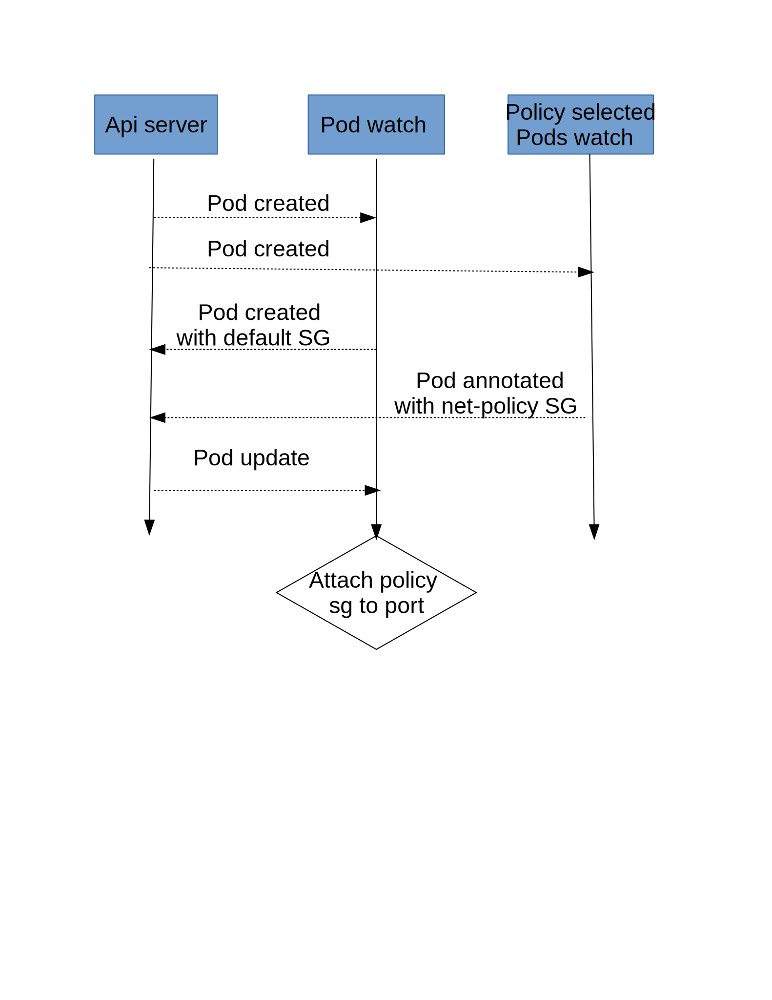

=======================
Network policy support
=======================

By default all Kubernetes pods are non-isolated and they accept traffic
from any source. "Network policy" is Kubernetes specification that defines how
groups of pods are allowed to communicate with each other and other network
endpoints [1]_.

This Spec suggests a design for supporting Kubernetes "Network policy" in
Kuryr.

Problem Description
===================

Kubernetes "Network policies" define which traffic is allowed to be
sent or received by group of pods.

Each network policy has 3 main parts [2]_:

* Pod selector: Use kubernetes "label selector" [5]_ that defines on which
  pods this policy should be applied. The relationship between pod and policy
  is N to M.
  Each pod can be selected by multiple network-policies (when an OR operator
  is applied between the policies), and each policy can be attached to
  multiple pods.
* Ingress section: defines which traffic can be received by selected pods.
  It's defined by a "Cartesian product" of (allowed peers) and (protocol).

  * There are 3 ways to define Allowed peer:

    * Ip-address-block: allowed CIDR (also enable to exclude an inner CIDR).
    * Pod selector: allowed set of pods defined by "label selector" [5]_.
    * Namespace selector: list of namespaces; all pods that belong to that
      namespaces are defined as allowed-peers.

  * Port is defined by 2 fields:

    * L4 protocol (TCP/UDP/ICMP..)
    * L4 destination port

* Egress section: defines which traffic can be sent from the selected pods.
  This is defined in the same way as the ingress section.

In order to support network-policy, kuryr-kubernetes should handle all the
events that are related to the network-policies and translate them into
Neutron objects for apply an equivalent network-topology to the one defined by
the Kubernetes policies. Neutron doesn't have a security API that is equivalent
to the kubernetes-network-policy. The translation should be done carefully
in order to achieve eventually consistent required topology, and avoid
corner-cases and race conditions.

Proposed solution
=================

This spec suggests to implement Kubernetes network-policy by leveraging Neutron
security-groups [4]_.
There is some similarity between security-groups and network-policy, but there
are also some definitions inside the network-policy that require some more
complex translation work.

In order to provide a full translation between kubernetes-policies to security
groups, there are 3 main issues that need to be consider:

* Translation of the kubernetes-policy to Neutron security-group object.

* Attaching the security-group to the relevant-ports according to
  the policy pod-selector.

* Response to changes in the group of pods that selected by pod selectors and
  namespace selector:

  * when pod is created and matches the queries
  * when pod is updated with new label, and that label matches to the query

The next paragraphs describe the implementation proposal for each of the tasks
described above, including new Handler and Drivers, that should be added to
the Kuryr controller.

Translate Kubernetes policy to Neutron security-group
-----------------------------------------------------

'Allow all' policy [3]_
#######################
Network policy that allows all traffic, should be translated to
Security group with one rule that allows all traffic.

Example for allow all egress traffic:

.. code-block:: json

  {
    "security_group_rule": {
      "direction": "egress",
      "protocol": null,
      "security_group_id": "[id]"
    }
  }

'Deny all' policy [6]_
######################

Translate to an empty-security-group.

Ingress/egress
##############

Can be translated to security-group-rules ingress/egress traits.

IpBlock:
########

Can be done by "remote ip prefix" trait in security-group-rule as both
use CIDRs. In case of Exceptions (It's an inner CIDR's of the ipBlock, that
should be excluded from the rule), the ip-range should be broken into pieces
that cover the all ip-block without the exception.
For example, if there is Ip-block :"1.1.1.0/24 except 1.1.1.0/26", Kuryr should
create security-groups-rules with 1.1.1.128/25 an 1.1.1.64/26).

podSelectors
############

Pod selector uses kubernetes label-selectors [6]_ for choosing set of pods.
It is used in the policy for 2 purposes:

* Define on which pods the policy should be applied.

* Allow ingress/egress traffic from/to this set of pods.

The first one defines on which ports the policy should be applied, so it will
be discussed in the next section. For the second, the translation mechanism can
use the security-group trait - "remote_policy_group", that allows to define as
valid source all ports that belong to another security-group. This means that
we could create security-group with no rules for each network-policy selector
and attach all ports corresponding to pods that selected by the pod query
to this security-group.
We assume that each port attached to this security-group will be attached to
at least one other group (default security-group), so that attachment will not
entirely block traffic to the port.

namespaceSelector
#################

Namespace selector is used for choosing all the pods that belong to the
namespaces that selected by the query for allowing ingress/egress traffic.
Should use the same security-group as the pod selector for allowing ingress/egress
traffic from the selected namespaces.

Port, protocol
##############

A port can be defined as a number or a name. When defined as a number, it's directly
translated to port on a protocol in security group rule. However, when defined with
a name, the container pods' name needs to be verified, and in case of matching the
named port it's translate to a security group rule with the port number of
the named port on a determined protocol.

The choice of which pods to select to check the containers, depends on the direction
of the rule being applied. In case of a ingress rule, all the pods selected by
NetworkPolicySpec's podSelector are verified, in other words, the pods which the
Network Policy is applied. For a egress rule, the pods selected
by the NetworkPolicyEgressRule's selector are verified.

To keep track of the pods that have container(s) matching a named port,
a new field, 'remote_ip_prefixes', needs to be added to the security group rule of the
KuryrNetPolicy CRD, containing the IP and the namespace of the affected resources.
This way, the process of creating, deleting or updating a security group rule
on pod events is facilitated.

Lets assume the following pod and network policy are created
(based on Kubernetes Upstream e2e tests [11]_):

  .. code-block:: yaml

    apiVersion: v1
    kind: Pod
    metadata:
      name: server
      labels:
        pod-name: server
    spec:
        containers:
        - env:
          - name: SERVE_PORT_80
            value: foo
          image: gcr.io/kubernetes-e2e-test-images/porter:1.0
          imagePullPolicy: IfNotPresent
          name: server-container-80
          ports:
          - containerPort: 80
            name: serve-80
            protocol: TCP
        - env:
          - name: SERVE_PORT_81
            value: foo
          image: gcr.io/kubernetes-e2e-test-images/porter:1.0
          imagePullPolicy: IfNotPresent
          name: server-container-81
          ports:
          - containerPort: 81
            name: serve-81
            protocol: TCP

    ---

    apiVersion: networking.k8s.io/v1
    kind: NetworkPolicy
    metadata:
      name: allow-client-a-via-named-port-ingress-rule
      namespace: default
    spec:
      podSelector:
        matchLabels:
          pod-name: server
      policyTypes:
      - Ingress
      ingress:
      - ports:
        - protocol: TCP
          port: serve-80

The following Custom Resources Definition is generated containing
all the Neutron resources created to ensure the policy is enforced.
Note that a 'remote_ip_prefixes' is added to keep track of the pod
that matched the named port.

  .. code-block:: yaml

    apiVersion: openstack.org/v1
    kind: KuryrNetPolicy
    metadata:
      annotations:
        networkpolicy_name: allow-client-a-via-named-port-ingress-rule
        networkpolicy_namespace: default
        networkpolicy_uid: 65d54bbb-70d5-11e9-9986-fa163e6aa097
      creationTimestamp: "2019-05-07T14:35:46Z"
      generation: 2
      name: np-allow-client-a-via-named-port-ingress-rule
      namespace: default
      resourceVersion: "66522"
      uid: 66eee462-70d5-11e9-9986-fa163e6aa097
    spec:
      egressSgRules:
      - security_group_rule:
          description: Kuryr-Kubernetes NetPolicy SG rule
          direction: egress
          ethertype: IPv4
          id: e19eefd9-c543-44b8-b933-4a82f0c300b9
          port_range_max: 65535
          port_range_min: 1
          protocol: tcp
          security_group_id: f4b881ae-ce8f-4587-84ef-9d2867d00aec
      ingressSgRules:
      - remote_ip_prefixes:
          "10.0.0.231:": default
        security_group_rule:
          description: Kuryr-Kubernetes NetPolicy SG rule
          direction: ingress
          ethertype: IPv4
          id: f61ab507-cf8c-4720-9a70-c83505bc430f
          port_range_max: 80
          port_range_min: 80
          protocol: tcp
          security_group_id: f4b881ae-ce8f-4587-84ef-9d2867d00aec
      networkpolicy_spec:
        ingress:
        - ports:
          - port: serve-80
            protocol: TCP
        podSelector:
          matchLabels:
            pod-name: server
        policyTypes:
        - Ingress
      podSelector:
        matchLabels:
          pod-name: server
      securityGroupId: f4b881ae-ce8f-4587-84ef-9d2867d00aec
      securityGroupName: sg-allow-client-a-via-named-port-ingress-rule

Mix of ports and peer
#####################

In this case security-group-rule should be created for each tuple of
peer and ports. Number of rules will be a Cartesian product of ports and
peers.

Match between security-groups and its ports
-------------------------------------------

A security-group that derived from kubernetes-policy should be
tagged [7]_ with network_policy UID. In case of issue of length or characters-set
hashing should be applied, so security-group unique tag could be derived from the
policy-UID.

For defining on which pods the policy should be applied Kubernetes defines a
pod-selector query [5]_. For applying the policy on the relevant ports, Kuryr
needs to know at any given moment which pods belong to that group. It can
happen when pod is created/updated/change-label.

When policy is created, Kuryr should trigger a get query for applying the
policy on all pods that already match,
and add a watch for getting an update when POD added or removed from
network-policy and apply/remove the translated policy on the pod's port.

For applying the policy on the pod, an annotation with the security-group-id
will be added to the pod. That will cause the "update pod" event.
The VIFHandler via security-group Driver will attach the pod to the port.

We can't attach the security-group directly in the watch callback as it
will create a race condition between the watch and the VIFHandler as
the watch could be called before Kuryr notified that the pod is created.
With the annotation - when new pod is created, if the watch was called
before VIFHandler pod creation processing, VIFHandler will get the pod already
with the annotation. Otherwise, it will get pod with no
security-group-annotation and will attach it to the default security-group.
When the watch will update the annotation, the pod will be updated with the
correct security-group.

When policy is updated, if policy pod-selectors changed,
a diff between the old and new selected-pod-set should be done,
and the pods security-groups annotations should be updated respectively.
Selector watches should be updated with the new queries.

Allow traffic from the pod ingress and egress selectors:
--------------------------------------------------------

As mentioned above, "remote_group_id" will be used to allow ingress and
egress traffic from pods selected by the pod/namespace selectors.

For the pod-selector and namespace-selector we need to
create a security-group per policy (one for ingress and one for egress).
The security-group should be tagged with tag that is derived from the
policy-UID and traffic direction (for example: [policy_UID]_EG for egress traffic).
In case of characters-sets or allowed-length issues, hash should be applied for
updating these security-groups.

For each selector (namespace or pod) a watch should be set. The watch callback
will add/remove the relevant pods to/from the security-group.

Controller Handlers and Drivers impact:
---------------------------------------

For supporting Network-policy Handler that watches network_policy events
will be added.

Two new drivers will be added:

* On the network_policy Handler:

  * "Network Policy Apply Driver", it will have 3 responsibilities:

    * Translate the network-policy to security-groups.
    * Match the security-group to its relevant port
      (by setting the watch and annotating the pod as described above).
    * Update the security-groups for ingress/egress POD/namespace selector.

* On VIF handler:

  * A security-group-policy Driver will be used instead of the default
    security groups Driver. It will be responsible for:

    * Set the port security-group according to the annotation.

Controller startup
------------------
The following should be done on Controller startup:

* Retrieve from Kubernetes API all network-policies and set all the
  relevant watches. This should happen before the Controller starts.

* Need to do some sync operation to make-sure Neutron topology is synchronised
  with Kubernetes Network Policy model.

  * for every network-policy:

    * Get it's main security-group and check if it's updated. This validation
      will be done by the generation tag. Generation is part of k8s metadata
      and increased by one on every policy change. When the policy will
      applied by kuryr, it's should be annotated with current policy generation.
      If the generation in the policy meta-data is newer than
      the generation in the annotation, it's mean that the policy had been
      changed and the security-group rules needs to rebuild.

    * for each pod selector in the policy:

      * get from kubernetes-api all pods that selected by this query.
      * get all ports of the relevant security-groups.
      * Do diff between port that needed to be attached to SG,
        and add/remove pod-ports from security-groups.

Port pool impact
----------------

Changes in the security-policy can cause negative impact on the port-pools [9]_.
The combination of the security-groups of port is part of the pool key, and
changes in network-policy could make some pools not relevant any more.

For example let's assume that we have 2 policies "a" and "b", and both policies
should be applied on pods with the label "role: db". When the first pod with
label "role: db" is created - a new port-pool is created and its pool key is
composed from the security-groups of "a" and "b". If policy "b" will be changed
and pods with label "role: db" would not be selected by the policy anymore,
then the port-pool that was created for the combination of "a" and "b" will not
be not useful any more.

That can lead to the ports leak, as pool holds many ports that not useful
anymore. For handling this issue a new cleanup task should be added. This task
will release all ports from the pools that are not in use anymore.

Another issue that needs to be treated is that the policies of pod can be
changed while pod is running. Currently when pod is deleted its' port is
returned to the pool that it was taken from. But if the pod's policies are
changed, this behaviour is incorrect. When port is released it should be
returned to the pool that matches to the current state of the pod.

Execution flow diagram
----------------------

See below the network policy attachment to the pod after pod creation:

Possible optimization:
----------------------

Kubernetes label-selector divided into 2 types of queries "match-labels",
and "match-expression" [10]_. "match-labels" selects a closed list of labels
while "match-expression" selects all pods that match to particular expression.

This spec suggests to create a watch for each label-selector query, because in
"match-expression" queries  it is not possible to determine if pod matches the
query, without implementing parser for each expression. By setting a watch we
are using kubernetes-api-server for the matching between pods and queries.

The spec treats the "match-labels" and "match-expression" queries in the same
way for simplicity reasons. But future optimization may distinguish between
queries-types. "match-labels" queries watches may be removed and the matching
between pod to its' "match-labels" queries could be done directly
on the vif-handler.

Assumptions
-----------

Security-groups are supported by the networking backend for all vif interfaces.
In case of special interfaces (SR-IOV, mac-vlan, etc ..), the network-policy
will be applied on the interface if and only if then networking backend
enables security-groups on those interfaces.

Execution flow-example
----------------------

This section describes system execution flow in the following scenarios:

* POD is deployed on empty system.
* Network-policy that should be applied on the first pod is deployed.
* Another pod that belongs to the network-policy is deployed.

Pod is deployed on empty system:

* Pod is created with the following details:

  * name: p1, namespace: default, labels : {Role:db}.

* VIF Handler:

  * Security-group-policy driver:

    * Assign default-policy to this pod (as we still
      do not have any network-policy in the system).
    * Create security-group for namespace 'default',
      and add pod p1 port to that security-group.

Network policy is deployed:

Let's assume that following policy is created (taken from k8s tutorial [8]_):

  .. code-block:: yaml

    apiVersion: networking.k8s.io/v1
    kind: NetworkPolicy
    metadata:
      name: test-network-policy
      namespace: default
    spec:
      podSelector:
        matchLabels:
          role: db
      policyTypes:
      - Ingress
      - Egress
      ingress:
      - from:
        - ipBlock:
            cidr: 172.17.0.0/16
            except:
            - 172.17.1.0/24
        - namespaceSelector:
            matchLabels:
              project: myproject
        - podSelector:
            matchLabels:
              role: frontend
        ports:
        - protocol: TCP
          port: 6379
      egress:
      - to:
        - ipBlock:
          cidr: 10.0.0.0/24
        ports:
        - protocol: TCP
          port: 5978

* Network policy Handler:

  * Network policy Driver:

    * Create security group with the following rules:

      * Ingress , tcp:6379  172.17.0.0/24
      * Ingress , tcp:6379  172.17.2.0/23
      * Ingress , tcp:6379  172.17.4.0.0/22
      * Ingress , tcp:6379  172.17.8.0/21
      * Ingress , tcp:6379  172.17.16.0/20
      * Ingress , tcp:6379 172.17.32.0/19
      * Ingress , tcp:6379 172.17.64.0/18
      * Ingress , tcp:6379 172.17.128.0/17
      * Ingress , tcp: 6379 , remote_group_id : [test-network-policy-uid]_in
      * Egress, tcp:5978 10.0.0.0/24

    * Create match for the policy:

      * Queries k8s-api about pods that match to {role:db}

        * Attach the annotation with security-policy-id to p1.

      * Set a watch on the query - "Match-label : {role:db}" , the watch
        callback of this watch will update the security-group annotation on
        the updated/new pods that are selected by this query.

    * Create a match for the ingress/egress group:

      * Set watch on the query : "match-labels {role:frontend}" , watch
        callback will add all pods that are selected by this query to the
        security-group [test-network-policy-uid]_in.

* VIF Handler:

  * Will get update event on p1 as its' annotations is changed.

    * security-policy-group-driver:

      * Attach the interface to its security-group.

Second pod is created:

* pod is created with the details:

  * name: p2 , namespace: default , labels : {Role:db}.

* Let's assume that VIF handler is called before watch-callback (as this case
  is little more complicated).

* VIF Handler:

  * Pod created event (still no namespace sg annotation on the pod).

  * Namespace security-group driver

    * Return the default network-policy.

  * Pod is created with default-policy.

* Watch Callback:

  * p2 is selected by security-group net-policy-test, annotates the pod
    with security-group-id that matches to the policy.

* VIF Handler:

  * security-group policy driver

    * Update pod P2 port with network policy driver.

References
==========
.. [1] https://kubernetes.io/docs/concepts/services-networking/network-policies/
.. [2] https://kubernetes.io/docs/api-reference/v1.8/#networkpolicy-v1-networking/
.. [3] https://kubernetes.io/docs/concepts/services-networking/network-policies/#default-allow-all-ingress-traffic
.. [4] https://developer.openstack.org/api-ref/network/v2/index.html#security-group-rules-security-group-rules
.. [5] https://kubernetes.io/docs/concepts/overview/working-with-objects/labels/
.. [6] https://kubernetes.io/docs/concepts/services-networking/network-policies/#default-deny-all-ingress-traffic
.. [7] https://docs.openstack.org/neutron/latest/contributor/internals/tag.html
.. [8] https://kubernetes.io/docs/concepts/services-networking/network-policies/#the-networkpolicy-resource
.. [9] https://github.com/openstack/kuryr-kubernetes/blob/master/doc/source/devref/port_manager.rst
.. [10] https://v1-8.docs.kubernetes.io/docs/api-reference/v1.8/#labelselector-v1-meta
.. [11] https://github.com/kubernetes/kubernetes/blob/master/test/e2e/network/network_policy.go
